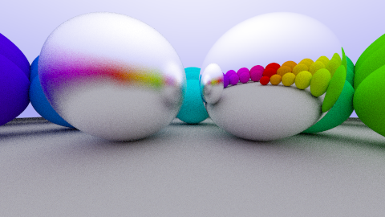
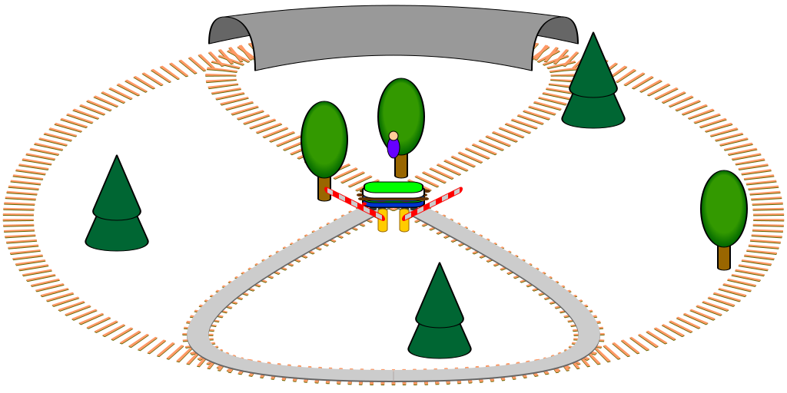

# Overview

-   Features
-   Installation
-   Usage
-   Development

# Speaker Notes

## Slide level {.split}

-   The slide content becomes part of the speaker notes
-   Add `notes` class to slide header

    ``` {.markdown}
    # Slide Level {.notes}

    These are speaker notes.
    ```

## Block level

-   Block content becomes part of the speaker notes
-   Add `notes` class to level two header

    ``` {.markdown}
    ## Block level {.notes}

    These are speaker notes too.
    ```

# These are just notes {.notes}

Slides with headers that are have the `.notes` class attribute are not included in the presentation. They are only visible in the handout and probably are available as presenter notes during slide presentation.

# Features {.section}

# Markdown Syntax

## Pandoc-Markdown

-   Slides are basically [Pandoc-Markdown](http://pandoc.org) formatted text
-   Pandoc provides a Markdown variant with many extensions

## Some Pandoc extensions

-   Bibliographies
-   Footnotes
-   Tables
-   Figures with captions
-   Code blocks with syntax highlighting
-   LaTeX math typesetting

# Slides

## Markdown header

-   Level 1 header (`#`) starts new slide
-   Level 2 header (`##`) starts a block on a slide

``` {.markdown}
# Episode IV: A new Slide

## A long time ago ...

... in a galaxy far, far away.
```

# Includes

## Include markdown files

The following text is included from file `/resource/realtive.md`:

[:include](include/relative.md)


# Multicolumn slides

## The author {.split}

{width="50%"}

[Deck markdown source](example-deck.md)

## Slide source

``` {.markdown}

# Multicolumn slides {.split}

## The author

{data-src="img/htr-beuth.jpg"}

## Slide source

~~~ {.markdown}
...
~~~
```

# Local Images

## Relative path

{width="75%"}

# SVG as image {layout="columns"}

## {.left}


## Source code {.right}

```markdown

```

# SVG embedded/included in html source {layout="columns"}

## {.left}

{.embed}

## Source code {.right}

```markdown
{.embed}
```

# LaTeX Math

## Syntax

-   Standard LaTeX syntax
-   Single \$ encloses inline math
-   Double \$\$ encloses a display math block

## Example

-   To $\infty$ and beyond!

$$
e = mc^2
$$

# Embedding Web Videos

## Macros {.split}

-   Appropriated image `` syntax
-		Currently possible for Youtube and Vimeo videos and Twitch channels
-		replace "page" with "youtube", "vimeo" or "twitch" and add video id or twitch channel name

    ``` {.markdown}
    ## Video

    
    Example:
    
    ```

## Video


# Compile Time Templating

## Mustache templates

-   Markdown source code is processed with Mustache

    ``` {.markdown}
    {{=<% %>=}}
    The current semester is {{semester}}
    <%={{ }}=%>
    ```

-   Data is provided in YAML files

    ``` {.yaml}
    ---
    semester: Summer 2016
    ---
    ```

-   Results in

    ``` {.markdown}
    The current semester is Summer 2016
    ```

# Blocks

## Block markup {.split}

-   Level 2 headers start new block
-   Blocks can be marked with attributes

## Alert block {.alert}

-   This block is marked `alert`

``` {.markdown}
## Alert block {.alert}

- This block is marked `.alert`
```

## Block styles

-   Other block styles include `definition` and `equation`

## Definition {.definition}

$e=mc^2$

## Equation {.equation}

$e=mc^2$

# Cached Images

## Local image cache {.split}

Remote images can be cached locally

Cache directory is named `img/cached` and is located in the directory of the referencing document

`decker cache` scans for and downloads all images

## Cached remote image

<!--

-->

## Not really!

-   Caching is currently disabled

# Meta Data

## Mustache template processor

-   Markdown source is processed by [mustache]()
-   Data is the union of all available YAML files

# Meta Data Example

## Markdown source

``` {.markdown}
Your total score is {\{total.score}}.
```

## YAML data

``` {.yaml}
---
total:
    score: 42
...
```

## Result

``` {.html}
Your total score is 42.
```

# Encoding

## UTF-8 encoding for everything

-   Markdown source files are assumed to be UTF-8 encoded
-   YAML metadata also

## German Umlaute

-   ÄÖÜäöüßß

## Substituted meta data

-   Umlaute: {{ümläüte}}
-   Signs: {{signs}}

# `decker` Tool {.section}

# `decker` Tool

## Command line tool

-   Statically linked, no library dependencies
-   Easy to deploy, just copy the executable
-   Self-contained, no support or data files
-   Not configurable, conventions are key

## Implemented using

-   [Haskell](http://haskell.org)
-   [Pandoc](), [Shake](), [Mustache](), [reveal.js]()
-   [LaTeX](), [decktape.sh]()
