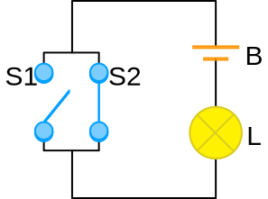

# Audience Response Polls

## Build Polls

- Currently support multiple choice questions
- Add `poll:true` to YAML
- Add `{.poll}` to slide header
- Optionally add chart specifications in YAML block on slide

# Audience Response Polls

## Interaction

- Press `c` to display the QR code
- Press `c` again to hide the QR code
- Press `a` to start the poll
- Press `a` again to close the poll
- Timed polls will automatically close


# Example Audience Response Poll {.poll}

## Question  {.qmc .plain}

In which wavelength spectrum of do semiconductor nodes reach litography?

- [x] X-Ray
- [ ] Long radio waves
- [ ] Microwave
- [ ] UV
- [ ] Infrasound
- [ ] 2 nm


# Boolean Representation {.poll}

## Question  {.qmc}

Which boolean function is displayed here?

- [ ] AND
- [ ] NAND
- [ ] XOR
- [x] OR
- [ ] FALSE
- [ ] TRUE

```yaml
label: "Votes"
color: "#080"
timed: True
seconds: 15
blink: True
``` 

## 




# No Poll Present

## {.qmc .plain}

In boolean algebra, which value represents true?

- [x] 1
- [ ] 0