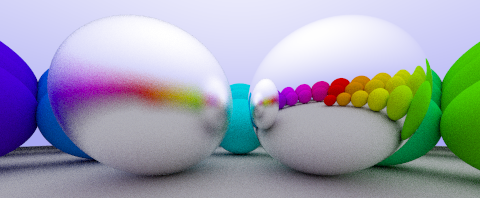

# Drag H2 Blocks around with the Mouse {.columns}

## Steps {.left}

1.  Press `M`
2.  Drag boxes around
3.  Press `M` again

## Try moving this {.fragment}



## Behind the scenes {.right .accent4 .fragment}

- Translation is encoded as a homgenous 3x3 matrix
- Repeated translation is pre-multiplied
- The matrix is assigned to `style.transform`
- A list of all manipulated blocks is saved as `*-manip.json`
- `*-manip.json` is loaded at start and applied

## Manipulation data example {.accent3 .fragment}

```json
"try-moving-this": {
"transform": "matrix(1,0,0,1,140.35086059570312,11.695906639099121)",
"width": 403.55999755859375,
"height": 203.34974670410156
},
```

---

# The fine print

## Only works on H2 blocks

- Right now anyways
- Requires the block to have a proper `id`
  - (currently generated by Pandoc for all section DIVs)

## Persistence only with Decker server

- Authoring: use locally with `decker -S`
- Presentation: any sever will do (just like `*-annot.json`)
