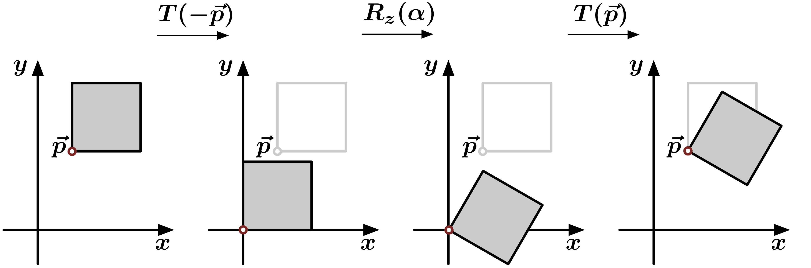

# Transformationen in homogenen Koordinaten {#arny}

Eine affine Transformation in Matrixschreibweise

$$
A(\mathbf{p})
=
\left(\begin{array}{ccc}
a&b&c\\
d&e&f\\
g&h&i
\end{array}\right)
\cdot 
\left(\begin{array}{c}
p_{x}\\
p_{y}\\
p_{z}
\end{array}\right)
+
\left(\begin{array}{c}
t_{x}\\
t_{y}\\
t_{z}
\end{array}\right)
$$

lautet in homogenen Koordinaten

$$
A(\mathbf{p})
=
\left(\begin{array}{cccc}
a&b&c&\color{red}{t_{x}}\\
d&e&f&\color{red}{t_{y}}\\
g&h&i&\color{red}{t_{z}}\\
0&0&0&\color{red}{1}
\end{array}\right)
\cdot 
\left(\begin{array}{c}
p_{x}\\
p_{y}\\
p_{z}\\
\color{red}{p_{w}}
\end{array}\right)
$$

------------------------------------------------------------------------

# Translation {#w0jo}

## Eigenschaften

$$
\begin{eqnarray}
T(\mathbf{0}) & = & I \qquad\mbox{(Einheitsmatrix)} \\
T(\mathbf{t})\cdot T(\mathbf{s}) & = & T(\mathbf{t}+\mathbf{s}) \\
T(\mathbf{t})\cdot T(\mathbf{s}) & = & T(\mathbf{s})\cdot T(\mathbf{t}) \\
T^{-1}(\mathbf{t}) & = & T(-\mathbf{t})
\end{eqnarray}
$$

Translationen haben keinen Effekt auf Richtungen!

$$
T(\mathbf{t})
=
\left(\begin{array}{cccc}
a&b&c&\color{red}{t_{x}}\\
d&e&f&\color{red}{t_{y}}\\
g&h&i&\color{red}{t_{z}}\\
0&0&0&\color{red}{1}
\end{array}\right)
\cdot 
\left(\begin{array}{c}
p_{x}\\
p_{y}\\
p_{z}\\
\color{red}{0}
\end{array}\right)
$$

------------------------------------------------------------------------

# Rotation {#ut0l}

## Eigenschaften

$$
\begin{eqnarray}
R_{\mathbf{a}}(0) & = & I \qquad\mbox{(Einheitsmatrix)} \\
R_{\mathbf{a}}^{-1}(\alpha) &=& R_{\mathbf{a}}(-\alpha) \\
R_{\mathbf{a}}^{-1}(\alpha) &=& R^{T}_{\mathbf{a}}(\alpha) \\
R_{\mathbf{a}}(\alpha)\cdot R_{\mathbf{a}}(\beta) &=& R_{\mathbf{a}}(\alpha + \beta) \\
R_{\mathbf{a}}(\alpha)\cdot R_{\mathbf{a}}(\beta) &=& R_{\mathbf{a}}(\beta)\cdot R_{\mathbf{a}}(\alpha) \\
&\mbox{aber}&\nonumber\\
R_{\mathbf{a}}(\alpha)\cdot R_{\mathbf{b}}(\beta) &\neq& R_{\mathbf{b}}(\beta)\cdot R_{\mathbf{a}}(\alpha)
\end{eqnarray}
$$

Dabei ist $R_{\mathbf{a}}$ eine Rotation mit Rotationsachse $\mathbf{a}$

---

# Beispiel: Rotation um einen Punkt {#oqn3}

1.  Verschiebe Rotationszentrum $\mathbf{p}$ nach $\mathbf{0}$
2.  Rotiere um $\mathbf{0}$
3.  Verschiebe zurück

$$
R_z(\mathbf{p},\alpha) = T(\mathbf{p})\cdot R_{z}(\alpha)\cdot T(-\mathbf{p})
$$

