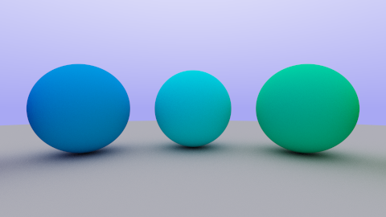

## Included

| 
| 

| 
| 

# Meta Data Values (Included)

## Resolved Values

-   existing-file-relative: [:meta](paths.existing-file-relative)
-   existing-file-absolute: [:meta](paths.existing-file-absolute)
-   non-existing-file-relave: [:meta](paths.non-existing-file-relative)
-   non-existing-file-absolute: [:meta](paths.non-existing-file-absolute)
