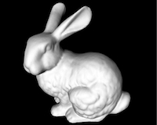

# {layout="columns"}

## {.left .align-center}

.](example-stanford-bunny-200x160.jpg){width="330px"}

.](example-stanford-bunny-200x160.jpg){width="330px"}

## What is Computer Graphics? {.question .right}

## Computer Graphics (CG) {.definition }
The science of the digital (1) creation, (2) processing, and (3) synthesis of visual content. 

##  Topics {}

1. Data representation
2. Processing and animation
3. Rendering and display
4. Interaction

## Note { .note}

- Includes interactivity and non-interactivity.
- Encompasses 2D and 3D.

# Plain Page, no starting H2 

This is some text which should span the whole line of text to fill-up two lines of text to really see what is going on when changing line spacings etc.

1. An ordered list

- Followed by some list item which also should be long enough to trigger a line break to see line spacings.   

Description
:   This is a description

## H2

Text would be good in between otherwise list and enumeration are on one line!

1. Followed by some enumeration and then an image

Or some more text 

1. Followed by an enumeration

# Plain Page, no starting H2 

1. An ordered list
   - Followed by some list item which also should be long enough to trigger a line break to see line spacings.
   - and another one   
2. Second ordered list item

- An li in an ul to see how it works the other way around
   1. An li in a sub ol.
   2. A second  li in a sub ol.
- And the closing li of the ul

# Plain Page, starting H2 on top 

##

This is some text which should span the whole line of text to fill-up two lines of text to really see what is going on when changing line spacings etc.

- Followed by some list item which also should be long enough to trigger a line break to see line spacings. 

Text would be good in between otherwise list and enumeration are on one line!

1. Followed by some enumeration and then an image

Or some more text 

1. Followed by an enumeration

# Plain Page, centered {.align-center}

- First Item
- Second item is a bit longer to see what happens

1. First ordered item
2. second ordered item a bit longer to see what happens

- First uo Item
   1. First ordered item nested

1. First ordered item 
   - First uo item nested

# Column Page, starting top column H2 {layout=columns}

## {.top}

This is some text which should span the whole line of text to fill-up two lines of text to really see what is going on when changing line spacings etc.

- Followed by some list item which also should be long enough to trigger a line break to see line spacings.    

Text would be good in between otherwise list and enumeration are on one line!

1. Followed by some enumeration and then an image

Or some more text 

1. Followed by an enumeration

# Column Page, starting top column H2 {layout=columns}

## {.top .question}

This is some text which should span the whole line of text to fill-up two lines of text to really see what is going on when changing line spacings etc.

- Followed by some list item which also should be long enough to trigger a line break to see line spacings.    

Text would be good in between otherwise list and enumeration are on one line!

1. Followed by some enumeration and then an image

Or some more text 

1. Followed by an enumeration

# Column Page, 2col, multiple elements {layout="columns"}

## This should be vertically {.left}

1. alligned
   - With right column block

- Then an image without caption above
   1. With some enumeration

## This should be vertically {.question}

1. alligned
   - With right column block

##

## This should be vertically {.question .right}

1. alligned
   - With left column block

- Then an image without caption above
   1. With some enumeration

## This should be vertically  {.note}

1. alligned
   - With left column block

## {.equation}

# Plain page video  

## Videos mit Caption default aligned 

{width=20%}

{width=20% controls=true autoplay=true} 

# Plain page video  

## Videos mit Caption aligned centered {.align-center}

{width=20%}

{width=20% controls=true autoplay=true} 

# Column Page, 2col, video  {layout="columns" .align-left}

## Videos mit Caption right aligned {.left .align-right}

{width=30%}

{width=30% controls=true autoplay=true} 

## Videos mit Caption left aligned {.right .align-left .note}

{width=30%}

{width=30% controls=true autoplay=true} 

# Column Page, 2col, videos  {layout="columns" .align-left}

## Videos no Caption right aligned {.left .align-right}

{width=30%}

{width=30% controls=true autoplay=true} 

## Videos no Caption left aligned {.right .align-left .note}

{width=30%}

{width=30% controls=true autoplay=true} 

# Column Page, 2col, multiple elements, split and join

## Start H2 block

## This should be vertically  {.split}

1. alligned
   - With right column block

- Then an image without caption above
   1. With some enumeration

## This should be vertically  {.alert}

1. alligned
   - With left column block

- Then an image without caption above
   1. With some enumeration

## Join H2 block {.join}

# Column Page, top+2col+bottom, multiple elements {layout="columns"}

## {.top}

This is some text which should span the whole line of text to fill-up two lines of text to really see what is going on when changing line spacings etc.

## This should be vertically {.left}

1. alligned
   - With right column block

- Then an image without caption above
   1. With some enumeration

## {}

## This should be vertically {.question .right}

1. alligned
   - With left column block

- Then an image without caption above
   1. With some enumeration

## {.equation}

## {.bottom}

This is some text which should span the whole line of text to fill-up two lines of text to really see what is going on when changing line spacings etc.

# Column Page, top+3col+bottom {layout="columns" }

## {.top}

This one is a longer test which is printed on top of each of the other columns to show how the whole thing is layed-out.

## Left {.left }

Some text and then 

- an item follows 

## Block {.definition }

   

## Center {.center .note}

Some text and then 

- an item follows 

## An end H2 Block {.note}
1. With enumeration
- and item at the end

## Right {.right}

Some text and then 

- an item follows 

## Block {.alert}

# Plain Page, no starting H2, Images side by side 

{.align-bottom}

{.align-bottom}

# Plain Page, starting H2, Images side by side 

## H2

{.align-bottom}

{.align-bottom}

# Column Page, Images side by side {layout=columns}

## {.left}

{.align-bottom}

## {.right}
{.align-bottom}

# Plain Page, no starting H2, Images centered {.align-center} 

{.align-bottom}

{.align-bottom}

# Plain Page, starting H2, Images centered {.align-center}

## H2

{.align-bottom}

{.align-bottom}

# Column Page, Images side by side {layout=columns .align-center}

## {.left}

{.align-bottom}

## {.right}
{.align-bottom}

# Single page, no columns, no H2  

Table: Assignment List

|  Week | Topic | Reading | Book |
|  ---: | :---  |  :---:  | ---- |
|   1   | Course Introduction | Chapt. 1 | Physics |
|   2   | Inertia, Equilibrium, Kinematics | Chapt. 2, 3, 4| Physics |
|   3   | Vectors, Momentum, Energy | Chapt. 5-8 | Physics |

# Single page, no columns, no H2, centered {.align-center}  

Table: Assignment List

|  Week | Topic | Reading | Book |
|  ---: | :---  |  :---:  | ---- |
|   1   | Course Introduction | Chapt. 1 | Physics |
|   2   | Inertia, Equilibrium, Kinematics | Chapt. 2, 3, 4| Physics |
|   3   | Vectors, Momentum, Energy | Chapt. 5-8 | Physics |

# Single page, no columns, top H2  

##

Table: Assignment List

|  Week | Topic | Reading | Book |
|  ---: | :---  |  :---:  | ---- |
|   1   | Course Introduction | Chapt. 1 | Physics |
|   2   | Inertia, Equilibrium, Kinematics | Chapt. 2, 3, 4| Physics |
|   3   | Vectors, Momentum, Energy | Chapt. 5-8 | Physics |

# Single page, no columns, top H2  

## H2 is centered {.align-center}

Table: Assignment List

|  Week | Topic | Reading | Book |
|  ---: | :---  |  :---:  | ---- |
|   1   | Course Introduction | Chapt. 1 | Physics |
|   2   | Inertia, Equilibrium, Kinematics | Chapt. 2, 3, 4| Physics |
|   3   | Vectors, Momentum, Energy | Chapt. 5-8 | Physics |
