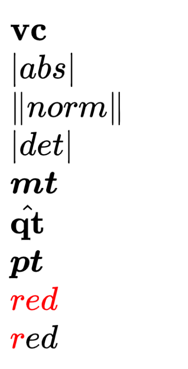

# Custom LaTeX Macros {layout=columns}

## macros {.left}

$\vc{vc}$\
$\abs{abs}$\
$\norm{norm}$\
$\mt{mt}$\
$\qt{qt}$\
$\pt{pt}$\
$\textcolor{red}{red}$\
$\textcolor{red}red$

## Should look like this image {.right}

{width="50%"}

# Test

`\begin{align*}   f(x) &= x^2\\   g(x) &= \frac{1}{x}\\   F(x) &= \int^a_b \frac{1}{3}x^3 \end{align*}`{=tex}

# test2

$$
  f(x) = x^2 \\
  g(x) = \frac{1}{x}\\
  F(x) = \int^a_b \frac{1}{3}x^3
$$

# test3

$$\lim_{x \to \infty} \exp(-x) = 0$$

# labeled equation

$$\begin{equation}
  E = mc^2
  \label{eq:einstein}
\end{equation}$$

# test4

  [$$
  \begin{eqnarray*}
  a &=& b \\
  a^2 &=& ab \\
  2a^2 &=& a^2 + ab \\
  2a^2-2ab &=& a^2 - ab \\
  2a(a-b) &=& a (a-b) \\
  2a &=& a \\
  2 &=& 1
  \end{eqnarray*}
  $$]{ .math-incremental }

::: footer
Reference label: $\eqref{eq:einstein}$
:::

# test5

This slide contains a math equation in the speaker notes. Press `s` to show it.

::: notes
Notes with math! $$\sum_i \pi^i \to \infty$$
:::

# test6

Test speaker notes again.

::: notes
Once more: $$\sum_i \pi^i \to \infty$$
:::
