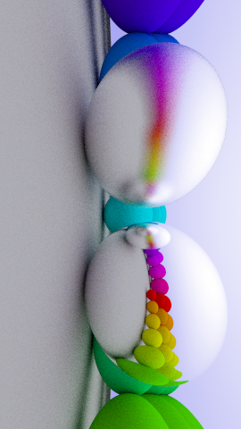
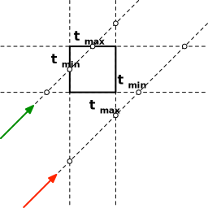

# Some Settings {.columns}

## Reveal {.left}

| Name     | Value                  |
| -------- | ---------------------- |
| `width`  | [:meta](reveal.width)  |
| `height` | [:meta](reveal.height) |
| `margin` | [:meta](reveal.margin) |
| `center` | [:meta](reveal.center) |

## Decker

| Name            | Value                  |
| --------------- | ---------------------- |
| `resource-pack` | [:meta](resource-pack) |

## Colors {.right}

| Shades                                                            | Accents                                                             |
| ----------------------------------------------------------------- | ------------------------------------------------------------------- |
| [`shade0`]{style="background-color:var(--shade0);padding:0 1em;"} | [`accent0`]{style="background-color:var(--accent0);padding:0 1em;"} |
| [`shade1`]{style="background-color:var(--shade1);padding:0 1em;"} | [`accent1`]{style="background-color:var(--accent1);padding:0 1em;"} |
| [`shade2`]{style="background-color:var(--shade2);padding:0 1em;"} | [`accent2`]{style="background-color:var(--accent2);padding:0 1em;"} |
| [`shade3`]{style="background-color:var(--shade3);padding:0 1em;"} | [`accent3`]{style="background-color:var(--accent3);padding:0 1em;"} |
| [`shade4`]{style="background-color:var(--shade4);padding:0 1em;"} | [`accent4`]{style="background-color:var(--accent4);padding:0 1em;"} |
| [`shade5`]{style="background-color:var(--shade5);padding:0 1em;"} | [`accent5`]{style="background-color:var(--accent5);padding:0 1em;"} |
| [`shade6`]{style="background-color:var(--shade6);padding:0 1em;"} | [`accent6`]{style="background-color:var(--accent6);padding:0 1em;"} |
| [`shade7`]{style="background-color:var(--shade7);padding:0 1em;"} | [`accent7`]{style="background-color:var(--accent7);padding:0 1em;"} |

---

# Slide Structure

```html
<section class="slide level1 present">
  <div class="decker">
    <div class="alignment">
      <h1>Licht</h1>
      <div class="layout">
        <div class="area">
          <div class="block">
            <h2>Some Header</h2>
            <p>Something or other</p>
          </div>
        </div>
      </div>
    </div>
  </div>
</section>
```

Caption: General structure of all slides

# Media Structure

```{.html line-numbers="1-4,6,7"}
<div class="media">
  <figure class="image">
    
    <figcaption>
      Alt Caption <span class="math inline">\(e=mc^2\)</span>
    </figcaption>
  </figure>
</div>
```

Caption: General structure of all media embeddings

# Development Path {.columns}

## Branch `develop-layout` {.left}

- Contains new slide and media renderer
- Is up to date with branch `develop`

## Branch `develop`

- Reveal 4 and Pandoc 2.14
- Default resource pack `decker`
- Resource packs `wburg` and `mario`

## The plan {.right .fragment}

1.  Cherry-pick fixes and features from `master` to `develop`
2.  On `develop-layout`
    - Port `wburg` CSS
    - Port `mario` CSS
3.  Merge `develop-master` to `develop`
4.  Merge `develop` to `master`

# Local Image

##


# Local Media in 2 columns {.columns}

## Left {.left}


## Right {.right}

```javascript
function rainbow(numOfSteps, step) {
  // This function generates vibrant, "evenly spaced" colours (i.e. no clustering). This is ideal for creating easily distinguishable vibrant markers in Google Maps and other apps.
  // Adam Cole, 2011-Sept-14
  var r, g, b;
  var h = step / numOfSteps;
```

Caption: Captioned code.

More `function CODE(here) {return true;}`{.javascript} here

---

# Local Media in 2 columns {.columns}

## Left {.left .question}


## Right {.right .answer}

```javascript
function rainbow(numOfSteps, step) {
  // This function generates vibrant, "evenly spaced" colours (i.e. no clustering). This is ideal for creating easily distinguishable vibrant markers in Google Maps and other apps.
  // Adam Cole, 2011-Sept-14
  var r, g, b;
  var h = step / numOfSteps;
```

Caption: Captioned code.

More `function CODE(here) {return true;}`{.javascript} here

---

# Local Media in 2 columns {.columns}

## Left {.left .definition}


## Right {.right .conclusion}

```javascript
function rainbow(numOfSteps, step) {
  // This function generates vibrant, "evenly spaced" colours (i.e. no clustering). This is ideal for creating easily distinguishable vibrant markers in Google Maps and other apps.
  // Adam Cole, 2011-Sept-14
  var r, g, b;
  var h = step / numOfSteps;
```

Caption: Captioned code.

More `function CODE(here) {return true;}`{.javascript} here

# More Images in 2 columns {.columns}

## Left {.left align="center"}


## Also left {align="right"}


## Right {.right align="center" grow="2"}


## And some more text {align="left"}

- Block distance fits.

# 2 images in a row

| 
| 
| {w:h="3/2.03"}
| 

Caption: Aspect ratio of images is determined at compile time, or can be
specified.

## Empty line block

|

# 3 somethings in a row

| 
| {.controls}
| {w:h="1/1"}

Caption: Caption all the things

## Fucking Notes {.notes}

- they do

# Blocks {.columns}

## One {.left}

- One slightly longer line.
- Should align with neighbors.

## Should align [:fas](arrow-right) {.warning align="right"}

One slightly longer line.

Should `align with`{.javascript} neighbors.

All right! [:fas](arrow-right)

## One slightly longer line. {.right .accent0}

One slightly longer line.

Should align with.

## [:fas](arrow-left) Should align {.accent1}

- One slightly longer line.

- Should align with neighbors.

[:fas](arrow-left) All right!

## Three {.accent3 .fragment popup="center-up"}

1.  Three 🍔🍔🍔
2.  Four 🍺🍺🍺🍺

## Source code is always nice {.accent0 .fragment popup="center-down" width="50%"}

```markdown
## Three {popup="center-up" .fragment .accent3}

1.  Three 🍔🍔🍔
2.  Four 🍺🍺🍺🍺
```

## How is my driving? {.accent4 .fragment popup="center" align="center"}

Too flashy?

Call the style police at

**015773846827**

# Local Image with caption block


Caption: Block Caption $e=mc^2$

# Local Image {.inverse}

## `{width=50%}`

{width="50%"}

# Local Image

## `{height=200px align=right}`

{align="right"
height="200px"}

# HTML for the last one

```{.html align="center" width="90%"}
<section id="local-image-height200px" class="slide level1">
<div class="decker">
<div class="section level1 alignment">
<h1>Local Image height=200px</h1>
<div class="layout">
<div class="area">
<div class="media" align="right">
<figure class="image" style="height:auto;width:auto;">

<figcaption>
Overwriting Block Caption <span class="math inline">\(e=mc^2\)</span>
</figcaption>
</figure>
</div>
</div>
</div>
</div>
</div>
</section>
```

Caption: Code blocks can have captions too.

# Local Image

## `{width=80% height=200px}`

{align="center" width="80%"
height="200px"}

# Local Inline Media

Some text {.controls .autoplay height="3em"} some
more {.code height="3em" width="10em"} code.

{height="60px"}{height="120px"}{height="240px"}

# HTML for the last one

```.html
<section id="local-inline-media" class="slide level1">
<div class="decker">
<div class="section level1 alignment">
<h1>Local Inline Media</h1>
<div class="layout">
<div class="area">
<p>Some text <span class="media"><span class="figure video" style="height:auto;width:200px;"><video controls="1" allow="autoplay" data-autoplay="1" style="height:auto;width:100%;" src="pacman-perfect-game.mp4"></video></span></span> some more.</p>
<p><span class="media"><span class="figure image"><span class="figcaption"><span>One</span></span></span></span> <span class="media"><span class="figure image" style="height:auto;width:auto;"><span class="figcaption"><span>Two</span></span></span></span></p>
</div>
</div>
</div>
</div>
</section>
```

# Iframe

{.iframe width="80%"}

# YouTube Video Stream

{width="80%"}

# Local Video

{.controls .autoplay width="60%"}

# PDF Object

{.pdf w:h="2/1"}

# Embeded SVG

{.embed width="400px"}

# Embeded SVG

{.embed width="400px"}

# Rendered Code

{.dot .render align="right" width="50%"}

Caption: Graphviz is cool.

# Rendered CodeBlock

```{.dot .render align="right" width="50%"}
digraph {
  node [style = filled]
  A [fillcolor = yellowgreen]
  A -> B
  A -> C
  C -> D
  C -> E
  C -> F
  B -> D
}
```

Caption: Graphviz is cool.

# Rendered Code Inline

_Really_ TINY shit: {.dot .render height="3em"}
{.dot .render height="2em"} {.dot .render
height="1em"}

# Execute Javascript

{.javascript .run}

# Execute Javascript CodeBlock

```{.javascript .run}
import * as mod from "../static/es6.js";
mod.hello(anchor, "orange");
```

Caption: What?

# Execute Javascript Inline

- Animation {.javascript .run} is followed by text

# An Mview Iframe {.columns}

## Markdown {.left}

```markdown

```

## Renders as {.right}


---

# Behind the Iron Curtain

# AST structure synthesis

## Branch `master`

```{.haskell .small}
caption = [Str "Caption", Space, Strong [Str "text"]]
html = toHtml caption
block = RawHtml ("<figcaption>" <> html <> "</figcaption>")
```

Caption: Just like PHP in the 90s

## Branch `develop-layout` {.fragment}

```{.haskell .small}
caption = [Str "Caption", Space, Strong [Str "text"]]
block = tag "figcaption" $ Div nullAttr [Plain caption]
```

Caption: More like JSX in the 20s

---

# AST structure synthesis

## Conversion status

- [:far](check-square) Embedded local media (Image, Video, PDF, ...)
- [:far](check-square) Code blocks (highlighted, rendered, executed)
- [:far](check-square) Iframes (generic URLs, Mview models)
- [:far](check-square) Streaming videos (Youtube, Vimeo, Twitch, ...)
- [:far](square) Quizzes
- [:far](square) Polls
