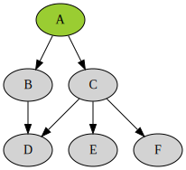

# Local Image

# Local Image 50%

{width="50%"}

# Local Video Autoplay

{.autoplay}

# Local Video 50%

{.controls .autoplay width="50%"}

# Local Video 100px

{.controls .autoplay height="100px" width="auto"}

# Local Video 200px x 200px

{.controls .autoplay width="200px" height="200px"}

# Local audio

{.controls .autoplay width="100px" height="100px"}

# Local Video And Audio

{.controls .autoplay}

{.autoplay}

# Local Video 1

{.controls .autoplay}

# Local Video 2

{.controls .autoplay}

# Local Video 3

{.controls .autoplay}

# Local Video 4

{.controls start="0.2" stop="0.5"}

# Local Video 5

{.controls .autoplay .loop}

# 3 Images in a Row

| 
| 
| 

Caption: Three in a row. With a caption below all three.

# 3 Somethings in a Row

| 
| {.controls .loop}
| 

Caption: Three somethings in a row. With a caption below all three. The
second one is a :cinema:.

# PDF

{width="900px" height="520px"}

# Ganz Schlimm Emdedded

{.embed}

