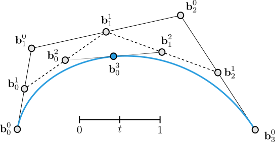

# Vektorgrafiken

::: columns-1-1

{ width=480px }

{ .embed width=480px }

:::

# Videos

{ width=512px .controls .muted }

# Externe Webseiten

{ width=800px .iframe }

# PDFs

{ width=800px }

# 3D-Modelle

{ width=800px }

# Geogebra

{ width=800px }