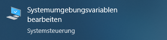
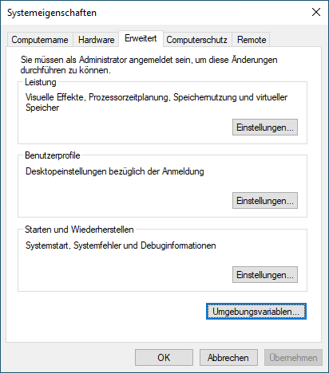
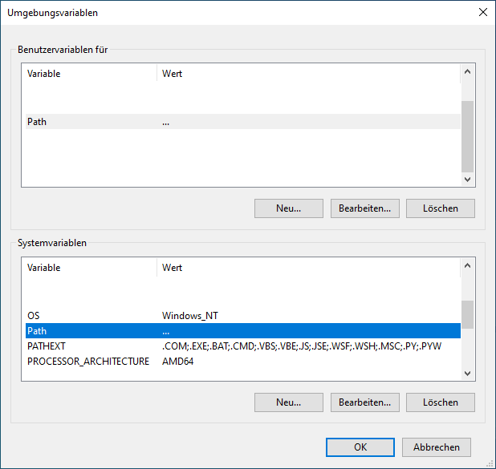
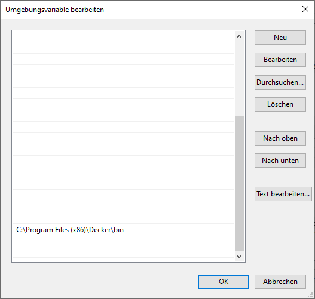
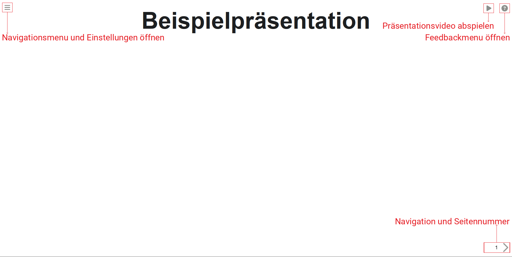
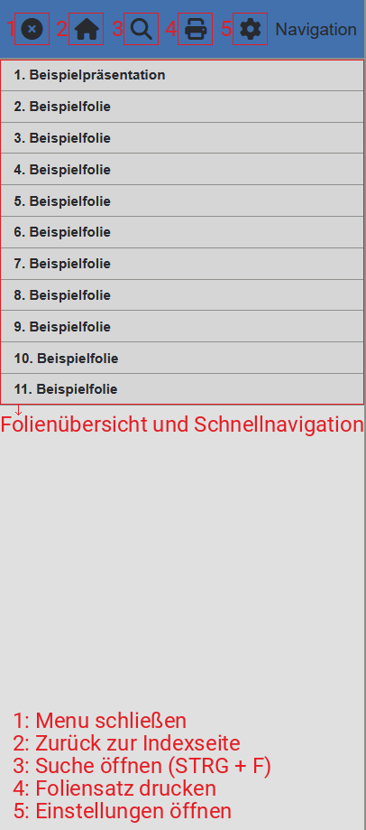
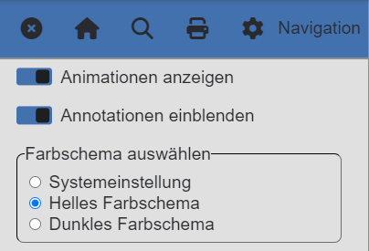
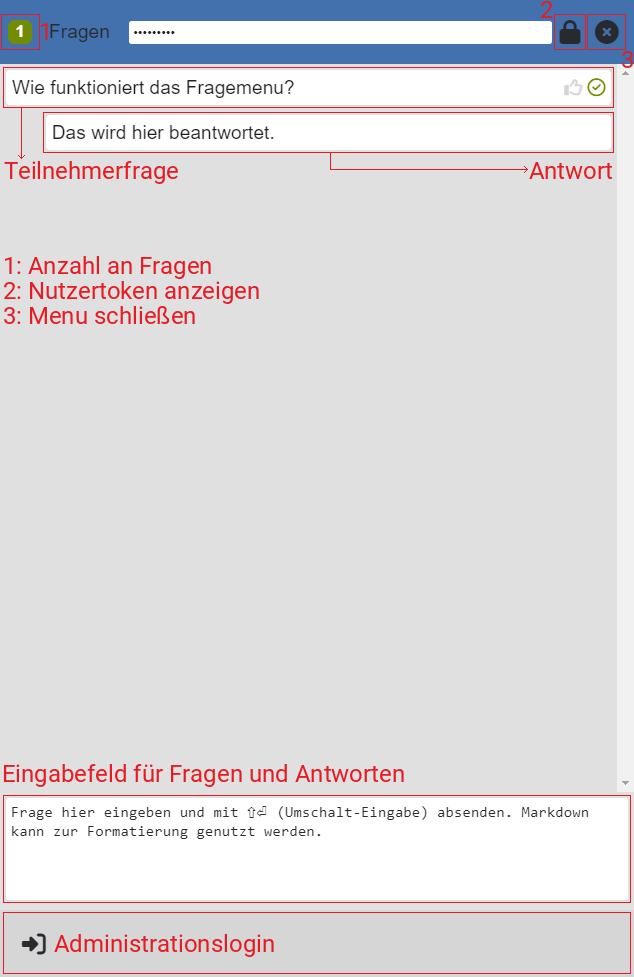
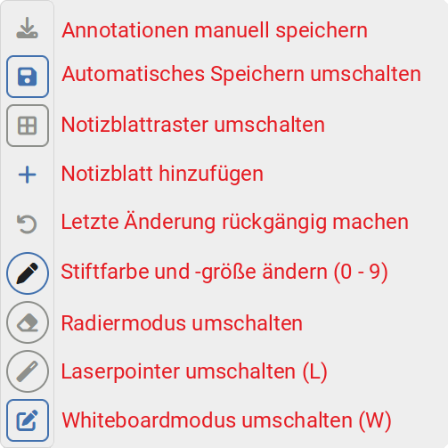
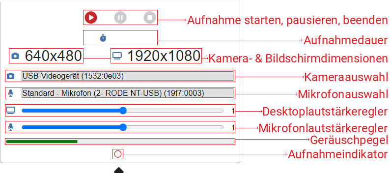

# Installation

In diesem Kapitel finden Sie alle Informationen zur Installation und Einrichtung des Programms `decker`.

## Windows

Zur Installation unter Windows wird ein Installationsprogramm bereitgestellt.

### Installation mit Installationsprogramm

Laden Sie dieses herunter und starten es. Das Installationsprogramm ist nicht signiert. Es kann daher sein, dass es vom Betriebssystem als unsicher eingestuft wird. Sie können die Warnmeldung jedoch getrost umgehen und es trotzdem ausführen.

Das Installationsprogramm nimmt zwei Änderungen an Ihrem System vor:

Zum einen kopiert es das Programm `decker` in das gewählte Installationsverzeichnis.

Zum anderen fügt das Installationsprogramm den Pfad zum Installationsverzeichnis zum Suchpfad für Programme hinzu, damit das Programm `decker` unter eben diesem Namen auch von anderen Programmen gefunden werden kann.

### Überprüfung der Installation

Wenn das Programm erfolgreich installiert wurde können Sie `decker` nun entweder manuell über die Windows PowerShell ausführen oder es von anderen Programmen wie z.B. den `decker`-Plugins von Visual Studio Code bedienen lassen.

Die Visual Studio Code Plugins werden Sie darüber informieren, wenn Sie das Programm `decker` nicht finden können.

Zum direkten Überprüfen, ob die Installation erfolgreich war, können Sie in der Windows PowerShell das Programm `decker` ausführen.

Des weiteren können Sie selbst überprüfen, ob das Programm `decker` im angegebenen Installationsverzeichnis zu finden ist.

Ist dem der Fall können Sie überprüfen, ob der Suchpfad korrekt angepasst wurde, indem Sie die Umgebungsvariablen des Systems begutachten:

#### Umgebungsvariablen unter Windows einsehen

Suchen Sie im Startmenu von Windows nach dem Begriff "Umgebungsvariablen":



Klicken Sie im Systemeigenschaften Dialog auf "Umgebungsvariablen":



Selektieren Sie anschließend die Variable "Path" entweder für den Nutzer oder das System:



Überprüfen Sie in der angezeigten Liste, ob der Installationspfad von Decker vorhanden ist:



### Installation per Hand

Sie können `decker` auch ohne das Installationsprogramm einrichten.

Downloaden Sie dazu das alleinstehende Programm `decker.exe`.

Legen Sie das Programm in ein Verzeichnis Ihrer Wahl.

Fügen Sie anschließend den Pfad zu diesem Verzeichnis dem Suchpfad des Systems hinzu, indem Sie einen Eintrag im im vorherigen Abschnitt beschriebenen Menu hinzufügen.

### Installation von optionalen Abhängigkeiten

Zusätzlich zu `decker` müssen Sie zum Nutzen aller Funktionalitäten folgende Programme separat installieren:

- [ffmpeg](https://ffmpeg.org/) zum Konveriteren von Videoaufnahmen, die mithilfe der Präsentationen angefertigt werden.
- [pdf2svg](https://github.com/jalios/pdf2svg-windows) zum Konvertieren von PDF-Dateien, die durch `pdflatex` beim Übersetzen von LaTeX-Quellcode generiert werden.
- [cwrsync](https://itefix.net/cwrsync) als Implementierung von `rsync` für Windows zur Verwendung von `decker publish`. Dieses setzt voraus, dass seine eigene Implementierung von `ssh` im Suchpfad vor der `OpenSSH` Implementierung von Windows liegt. Wenn Sie also andere Programme nutzen, die `ssh` verwenden überprüfen Sie nach Installation, ob diese mit der Cygwin-Version von `cwrsync` kompatibel sind. Das `rsync`-Programm von cwrsync funktioniert **nicht** mit der vorinstallierten `ssh`-Implementierung von Windows.

`decker` verwendet zur Umsetzung einzelner Funktionalitäten externe Programme.

`decker publish` benötigt `rsync` zum Synchronisieren Ihres Projektes auf einem externen Webserver.

`decker crunch` benötigt `ffmpeg` zum Konvertieren und Komprimieren von Videoaufnahmen.

`decker`, `decker html`, `decker decks`, `decker pages` und `decker handouts` benötigen zum Übersetzen von LaTeX Quellcodefragmenten eine installierte LaTeX-Distribution, die das Programm `pdflatex` zur Verfügung stellt. Zusätzlich wird `pdf2svg` genutzt, um die generierten PDFs in SVGs umzuwandeln, die dann in die Präsentation eingebettet werden.

Das selbe gilt für Quellcodefragmente für die Programme `gnuplot` und `plantuml`. Die entsprechenden Programme müssen ebenso separat installiert werden. `plantuml` wird unter Windows jedoch nicht als ausführbare Datei, sondern als nur als Java-Archiv ohne ausführendes Skript, ausgeliefert und kann deswegen nicht ausgeführt werden.

## Linux

Die Installation von `decker` für Linux geschieht am schnellsten per Hand:

Zuerst laden Sie das ausführbare `decker`-Programm herunter.

Anschließend kontrollieren Sie, ob das Programm als **ausführbar** markiert ist und setzen es gegebenenfalls als solches: `chmod +x decker`.

Im Anschluss legen Sie das Programm in einem Verzeichnis ab, das auf Ihrem Suchpfad liegt.

Dieses ist für den einzelnen Benutzer für gewöhnlich `~/.local/bin/` oder Systemweit `/usr/local/bin/`.

### Installation optionaler Abhängigkeiten

Die optionalen Abhängigkeiten von `decker` sind:

- `ssh`
- `rsync`
- `ffmpeg`
- `gnuplot`
- `graphviz`
- `plantuml`
- `pdflatex` (z.B. aus dem Paket `texlive-full`)
- `pdf2svg`
- `google-chrome`

## MacOS

Für MacOS wird ein Installationspaket bereitgestellt.

Dieses ist nicht signiert, daher müssen Sie bei Installation bestätigen, dass Sie die Sicherheitswarnung ignorieren wollen.

# Anwendungsfunktionen

`decker` ist eine Anwendung, die Sie für gewöhnlich über die Kommandozeile ihres Systems bedienen sollten. Sie können dem Aufruf von `decker` unterschiedliche zusätzliche Argumente übergeben, um die auszuführende Funktion zu ändern. Im Folgenden werden diese Funktionen im Detail beschrieben.

Sie können ausgewählte Funktionalitäten von `decker` auch über das Visual Studio Code Plugin `decker server` mithilfe eines Rechtsklicks auf ihr Projektverzeichnis in der Dateiübersicht von Visual Studio Code aufrufen. Entsprechend brauchen Sie zum Bedienen der wichtigsten Funktionen von `decker` keine Kenntnisse in der Steuerung von Programmen über die Kommandozeile.

## Verzeichnis als Projektverzeichnis markieren

Damit das Programm `decker` das aktuelle Arbeitsverzeichnis als ein Projektverzeichnis erkennt muss im aktuellen Arbeitsverzeichnis eine Datei mit dem Namem `decker.yaml` enthalten sein. Die Datei muss selbst keinen Inhalt besitzen. In ihr können Sie Konfigurationsoptionen für ihr gesamtes Projekt hinterlegen. Näheres dazu können Sie im Kapitel für [Konfigurationsoptionen](#konfigurationsoptionen) erfahren.

## Grundlagen

Die Hauptaufgabe des Programms `decker` ist es Markdowndateien in Foliensätze oder Webseiten zu übersetzen. Die übersetzten Dateien, sowie alle Dateien, die zum Anzeigen der jeweilig erzeugten Dateien im Browser notwendig sind, werden in einem Verzeichnis mit dem Namen `public` abgelegt. Dieses Verzeichnis kann als solches von einem Webserver ausgeliefert werden, um die Präsentation auf dem lokalen Rechner oder auf ihrem eigenen Webhost zur Verfügung zu stellen.

Markdownquelltextdateien, die auf `-deck.md` enden werden in Foliensätze mit der Dateiendung `-deck.html` übersetzt. Markdownquelltextdateien, die auf `-page.md` enden werden in Webseiten mit der Dateiendung `-page.html` übersetzt.

Für jedes Projekt wird zusätzlich mindestens eine Datei mit dem Namen `index.html` generiert. Den Inhalt dieser Datei können Sie durch anpassen einer Datei `index.md` im Wurzelverzeichnis ihres Projektes ändern. Näheres dazu im Kapitel zur Indexdatei.

Zusätzlich können für `-deck.md`-Dateien auch Handouts mit der Dateiendung `-handout.html` erzeugt werden. Näheres dazu im Abschnitt zu [`decker handouts`](#handouts-generieren).

Für bereits übersetzte Foliensätze können mithilfe des Browsers Google Chrome PDF-Dateien der Foliensätze erzeugt werden. Diese werden in Dateien mit der Dateiendung `-deck.pdf` abgelegt. Näheres dazu im Abschnitt zu [`decker pdf`](#pdfs-generieren).

### Beispiel

Ihr Projektverzeichnis beinhalte folgende Dateien.

```
decker.yaml
presentation-deck.md
supplementary-page.md
```

Ein Aufruf des Programms `decker`, gefolgt von `decker handouts` und `decker pdf` erzeugt folgende Resultate in Ihrem `public`-Verzeichnis:

```
index.html
presentation-deck.html
presentation-handout.html
pesentation-deck.pdf
supplementary-page.html
```

Zusätzlich werden Sie weitere Dateien in dem `public`-Verzeichnis vorfinden: `.json`-Dateien, ein `.decker`-Verzeichnis und das `support`-Verzeichnis. Deren Zweck wird im Kapitel für Technische Details und Ressourcenpakete behandelt und ist an dieser Stelle erstmal nicht relevant.

## Grundausführung

Rufen Sie das Programm `decker` ohne weitere Argumente auf werden aus allen im Projektverzeichnis und seinen Unterverzeichnissen befindlichen `-deck.md`- und `-page.md`-Dateien Foliensätze bzw. Webseiten generiert. Weitere Funktionalitäten können dieser Grundausführung in Zukunft hinzugefügt werden. Bisher ist dieser Aufruf identisch zum Aufruf `decker html`.

## HTML-Dateien generieren

Rufen Sie das Programm `decker` mit dem Argument `html` als `decker html` auf werden aus allen im Projektverzeichnis und seinen Unterverzeichnissen befindlichen `-deck.md`- und `-page.md`-Dateien Foliensätze bzw. Webseiten generiert. Dieser Aufruf ist zum expliziten Beschränken der Übersetzung auf diese Ergebnisse gedacht. Aktuell ist er identisch zum Aufruf von `decker` ohne Argumente.

## Foliensätze generieren

Rufen Sie das Programm `decker` mit dem Argument `decks` als `decker decks` auf werden aus allen im Projektverzeichnis und seinen Unterverzeichnissen befindlichen `-deck.md`-Dateien Foliensätze generiert. Dieser Aufruf beschränkt sich anders als der Aufruf von `decker html` auf die Foliensätze.

## Webseiten generieren

Rufen Sie das Programm `decker` mit dem Argument `pages` als `decker pages` auf werden aus allen im Projektverzeichnis und seinen Unterverzeichnissen befindlichen `-page.md`-Dateien Webseiten generiert. Dieser Aufruf beschränkt sich anders als der Aufruf von `decker html` auf die Webseiten.

## Handouts generieren

Rufen Sie das Programm `decker` mit dem Argument `handouts` als `decker handouts` auf werden aus allen im Projektverzeichnis und seinen Unterverzeichnissen befindlichen `-deck.md`-Dateien Handouts generiert. Diese repräsentieren den textuellen Inhalt des Foliensatzes und sind zum Nachlesen der Präsentation oder als Alternative für Nutzer von assistiven Technologien gedacht.

## PDFs generieren

Das Generieren von PDF-Dateien aus den Foliensätzen verwendet das Programm Google Chrome. Die Funktionalitäten von Google Chrome, die das Generieren von PDF-Dateien aus Webseiten erlaubt funktioniert nicht in der Version, die für Windowssysteme ausgeliefert wird. Entsprechend ist diese Funktionalität von `decker` nur unter Linuxsystemen und MacOS verfügbar. Wenn Sie unter Windows PDF-Dateien Ihrer Foliensätze haben möchten müssen Sie die Foliensätze mithilfe von `decker --server` in ihrem Browser selbst aufrufen und über das Navigationsmenu das Drucken des Foliensatzes als PDF manuell durchführen.

Das Aufrufen von `decker` mit dem Argument `pdf` benötigt bereits gebaute Foliensatzdateien, die mit Google Chrome geöffnet und mithilfe dieses Programms in ihre entsprechenden PDF-Dateien gedruckt werden. Entsprechend werden wie beim Aufruf von `decker decks` die Foliensätze übersetzt, bevor die eigentliche Funktionalität dieses Aufrufs umgesetzt wird.

## Projektverzeichnis aufräumen

Rufen Sie `decker` mit dem Argument `clean` auf wird das `public`-Verzeichnis gelöscht. Dies dient zum aufräumen und entfernen aller generierten Dateien, damit ein erneuter Übersetzungsvorgang alle Dateien neu übersetzen muss.

## Projektverzeichnis vollständig bereinigen

Neben dem `public`-Verzeichnis wird auch zusätzlich ein Verzeichnis namens `.decker` angelegt, in dem für den Übersetzungsprozess wichtige Metadaten zwischengespeichert werden. Diese müssen für gewöhnlich nicht erneut angelegt werden, wenn ein Projekt wiederholt übersetzt wird.

Möchten Sie jedoch das Projektverzeichnis von absolut allen von `decker` generierten Dateien bereinigen können Sie mithilfe von `decker purge` alles entfernen lassen.

## Projektverzeichnis veröffentlichen

Rufen Sie `decker` mit dem Argument `publish` als `decker publish` auf wird das Programm angewiesen mithilfe des Programms `rsync` ihr `public`-Verzeichnis auf einem anderen Rechner zu veröffentlichen. Das Programm `rsync` muss entsprechend auf Ihrem Rechner zur Verfügung stehen. Unter Windows bedeutet dies meist die Installation von Linux-Werkzeugen mithilfe der Umgebungen CygWin oder MinGW.

Die Konfiguration von `rsync` durch `decker publish` wird im Kapitel Konfigurationsoptionen behandelt.

## Dateien beobachten

Mithilfe der Programmoption `-w` bzw. `--watch` können Sie das programm `decker` dazu anweisen die Quelldateien in Ihrem Projektverzeichnis zu beobachten. Der Aufruf von Decker mit dieser Option muss manuell beendet werden, wenn Sie die Beobachtung beenden wollen. Wenn Änderungen an Ihren Quelldateien festgestellt werden baut `decker` die davon betroffenen Zieldateien sofort neu.

## Webserver starten

Der Aufruf von `decker` mit dem Argument `serve` als `decker serve` startet einen lokalen Webserver auf ihrem Rechner. Sie können mit der Option `-p` können Sie den Port, auf dem der Webserver horcht ändern. Der Standardport ist `8888`. Entsprechend erreichen Sie den Webserver mithilfe Ihres Browsers gewöhnlicherweise unter der Adresse [http://localhost:8888](http://localhost:8888).

Wenn Sie `decker` mit der Option `-S` oder `--server` starten wird wie beim Aufruf von `serve` ein Webserver gestartet. Zusätzlich werden alle Quelltextdateien beobachtet und neu gebaut, wenn sie geändert werden, wie beim Aufruf von `decker --watch`. Zusätzlich werden angezeigte Foliensätze und Webseiten in Ihrem Browser dazu angewiesen ihren Inhalt neu zu laden, wenn ihre Quelldateien neu übersetzt wurden. Dadurch können Sie Änderungen an Ihrem Quelltext sofort in Ihrem Browser begutachten und nachvollziehen. Entsprechend ist der Aufruf von `decker --server` dem Aufruf von `decker serve` im Allgemeinen zu bevorzugen.

## Videodateien konvertieren

Videodateien, die sie mithilfe der Webpräsentationen von `decker` erstellen werden im `.webm`-Format abgespeichert. Zum Ausliefern der Videos mit ihrer Präsentation ist das Verwenden von `.mp4`-Dateien notwendig.

Rufen Sie `decker` mit dem Argument `crunch` als `decker crunch` auf wird das Programm dazu angewiesen mithilfe des Programms `ffmpeg` alle `-recording.webm`-Dateien, die zu ihren Präsentationen gehören, in entsprechende `-recording.mp4`-Dateien umzuwandeln. Videos, die Sie in mehreren Teilen aufgenommen haben werden ebenfalls durch diesen Befehl zusammengeführt.

## Optionale Abhängigkeiten überprüfen

Der Aufruf von `decker` mit dem Argument `check` als `decker check` weist das Programm dazu an zu überprüfen welche optionalen Abhängigkeiten installiert sind und in einer Liste aufzuzählen.

## Versionsinformationen

Der Aufruf von `decker` mit dem Argument `version` als `decker version` gibt Informationen über die verwendete Version von `decker` und internen Bibliotheken auf der Kommandozeile aus.

# Markdown

Quelltextdateien von Decker werden in der Auszeichnungssprache [Markdown](https://daringfireball.net/projects/markdown/) geschrieben.

Markdowndateien mit der Endung `-deck.md` werden von Decker in Foliensätze mit der Endung `-deck.html` übersetzt während Markdowndateien mit der Endung `-page.md` in Webseiten mit der Endung `-page.html` übersetzt werden.

Im Kopf der Markdowndateien können in einem speziellen Bereich, dem *Frontmatter*, markiert durch zwei Zeilen in denen drei Bindestriche (`---`) stehen, Konfigurationseinstellungen für diese Datei notiert werden. Eine Markdowndatei hat daher fast immer folgendes Grundaussehen:

``` yaml
---
Konfigurationseinstellungen
---

Dokumenteninhalt
```

## Grundlagen

Markdown ist eine Auszeichnungssprache, die dazu gedacht ist direkt in HTML-Dokumente überführt zu werden. Ihr Ziel ist es dabei im besonderen den auf der übersetzten Webseite repräsentierten Text im Quelltext so ähnlich wie möglich wiederzuspiegeln.

Als solche besitzt Markdown keine wirklichen Möglichkeiten zum definieren von Layout oder Design des repräsentierten Textes. Dies ist Aufgabe der Webseite, in die der aus dem Markdown-Quelltext übersetzte HTML-Quellcode eingebettet wird.

Decker verwendet zur Übersetzung von Markdown nach HTML die Bibliothek `pandoc`. Diese erlaubt es den Übersetzungsprozess von Markdown nach HTML anzupassen und um viele zusätzliche Funktionalitäten zu erweitern. Im Folgenden werden daher sowohl die weiter verbreiteten Markdowngrundlagen erklärt, als auch die von Decker verwendeten Anpassungen.

In Markdown werden alle Textbausteine semantisch durch eine Leerzeile (zwei aufeinander folgende Zeilenumbrüche) voneinander getrennt. Dies erlaubt es im Quelltext einzelne Bausteine schnell voneinander zu unterscheiden. Im übersetzten Dokument werden einzelne Textbausteine für gewöhnlich untereinander angeordnet. Dies macht sich im Fließtext meist durch einen sichtbaren Zeilenunbruch und einen kleinen Abstand zwischen den Textbausteinen bemerkbar.

### Überschriften

In Markdown werden Überschriften mithilfe von `#`-Rauten-Symbolen eingeleitet. Die Anzahl an `#`-Rauten-Symbolen bestimmt die Ebene der Überschrift:

``` markdown
# Überschrift der Ebene 1
```

Überschriften der Ebene 1 haben für `decker` eine besondere Bedeutung, denn sie leiten eine neue Folie in einem Foliensatz ein. Die verwendete Überschrift ist dann der Titel der entsprechenden Folie.

Wenn Sie eine neue Folie ohne Titel einleiten wollen, können Sie dies mit einer `#`-Raute ohne weiteren Text umsetzen:

```
#

Folieninhalt
```

In `-page.md`-Webseitendateien haben Überschriften der Ebene 1 keine besondere Bedeutung und werden nur als Überschriften für neue Abschnitte verwendet.

#### Beispiele

Überschriften der Ebene 1 leiten neue Folien in Ihrem Foliensatz ein:

```
# Meine erste Folie

Dies ist meine erste Folie.

# Meine zweite Folie

Dies ist meine zweite Folie.

#

Diese Folie hat keinen Titel.
```

Überschriften anderer Ebenen können Sie benutzen um den Inhalt einer Folie zu strukturieren:

```
# Folientitel

Text

## Themenüberschrift

Mehr Text

## Weiteres Thema

Noch mehr Text

### Unterunterüberschrift

Viel mehr Text
```


### Paragraph

Einen einzelnen Textparagraphen können Sie in Markdown durch notieren des Textinhalts im Quelltext beschreiben. Wie alle Quelltextbausteine in Markdown werden zwei Paragraphen von einer Leerzeile voneinander getrennt.

Möchten Sie innerhalb eines einzelnen Paragraphen einen Zeilenumbruch einfügen so müssen Sie die Zeile im Quelltext, nach der Sie umbrechen wollen, mit **zwei Leerzeichen** beenden.

#### Beispiel

Wenn Sie zwei Zeilen im Quelltext folgendermaßen notieren werden Sie als zwei Teile ein und des selben Paragraphen verstanden. Zeilenumbrüche, die im Quelltext vorkommen werden im Resultat nicht übernommen:

``` markdown
Diese Zeile gehört zu einem Paragraphen.
Diese Zeile gehört zum selben Paragraphen. Im Resultat werden beide Zeilen ungetrennt hintereinander stehen.
```

In folgendem Quelltextbeispiel wird nach der ersten Zeile ein Zeilenumbruch eingefügt. Markieren Sie den foglenden Quelltext mit der Maus um die Leerzeichen am Ende der ersten Zeile zu sehen.

``` markdown
Diese Zeile ist Teil eines Paragraphen. Nach ihr wird umgebrochen.  
Diese Zeile ist Teil des selben Paragraphen, vor ihr wurde jedoch umgebrochen.
```

Möchten Sie zwei Paragraphen voneinander trennen müssen Sie diese im Quelltext mit einer Leerzeile voneinander trennen:

``` markdown
Diese Zeile gehört zu einem Paragraphen.

Diese Zeile gehört zu einem anderen Paragraphen.
```

Wenn Sie eine Folie mit viel Fließtext haben sähe eine Anordnung zum Beispiel folgendermaßen aus:

```
Lorem ipsum dolor sit amet, consectetur adipiscing elit, sed do eiusmod tempor incididunt ut labore et dolore magna aliqua.
Ut enim ad minim veniam, quis nostrud exercitation ullamco laboris nisi ut aliquip ex ea commodo consequat.

Duis aute irure dolor in reprehenderit in voluptate velit esse cillum dolore eu fugiat nulla pariatur. Excepteur sint occaecat cupidatat non proident, sunt in culpa qui officia deserunt mollit anim id est laborum.
```


### Textdekoration

In Markdown können Sie Fließtext mit Sonderzeichen umranden. Der Text zwischen den Sonderzeichen wird besonders dargestellt.

Wenn Sie Text mit einzelnen `*`-Asterisk-Symbolen umranden wird dieser *emphasiert*. Dies geschieht für gewöhnlich durch *kursiven Text*.

Wenn Sie Text mit zwei `**`-Asterisk-Symbolen umranden wird dieser **gestärkt**. Dies geschieht für gewöhnlich durch **Fettdruck**.

Das verwenden von drei `***`-Asterisk-Symbolen wendet beide ***Textdekorationen*** auf den Text an.

Weitergehend können Sie Text mit zwei `~~`-Tilden umranden, um ihn ~~durchzustreichen~~.

Quelltext können Sie im Fließtext mithilfe von einzelnen `` ` ``-Backtick-Symbolen markieren. Dieser wird für gewöhnlich in einem `Monospace-Font` dargestellt. Soll Ihr Quelltext selbst auch einzelne `` ` ``-Backtick-Symbole beinhalten können Sie auch zwei ` `` ` zur Umrandung verwenden.

Sie können keinen Text unterstreichen, da er auf Webseiten ansonsten mit Links verwechselt wird.

#### Beispiel

Im Quelltext würden Sie die Textdekorationen folgendermaßen verwenden:

``` markdown
Folgender Text ist *kurisv*.

Folgender Text ist **fett**.

Folgender Text ist ***kursiv und fett***.

Folgender Text ist ~~durchgestrichen~~.

Folgender Text ist `Quelltext`.
```


### Blockzitate

Sie können einen Paragraphen als Blockzitat kennzeichnen, indem Sie ihn mit einem `>`-Kleiner-Symbol einleiten. Sie können weitere Zeilen hinter dem Blockzitat mit weiteren `>` einrücken, müssen dies jedoch nicht tun solange Sie die Inhalte nicht mit Leerzeilen voneinander trennen. Erst wenn Sie das Zitat mit zwei Zeilenumbrüchen vom nächsten Textbaustein trennen wird es beendet. Im Fließtext des Blockzitats gelten die selben Regeln für Zeilenumbrüche und Textdekoration wie für Paragraphen.

`decker` erlaubt es zusätzlich eine Quellenangabe oder sonstige Unterschrift dem Blockzitat hinzufügen. Sie können dies durch Notieren eines neuen Paragraphen direkt hinter dem Zitat umsetzen, der mit der Zeichenfolge `Caption:` beginnt.

#### Beispiel

Im Quelltext können Sie ein Blockzitat folgendermaßen angeben:

``` markdown
> Dies ist in Blockzitat.  
> Dieser Text gehört *weiterhin* zum Blockzitat.
Dieser Text ebenso.
> Auch diese Zeile setzt das Zitat fort, obwohl die Zeile über ihr nicht mit einem `>` beginnt.

Caption: Dies wird zur Zitatunterschrift des Blockzitats.

Erst dieser Text ist wieder sein eigener Paragraph.
```

Ein praktisches Beispiel in einer Folie wäre folgendes:

```
Einst sagte ein berühmter Naturwissenschaftler:

> Insofern sich die Sätze der Mathematik auf die Wirklichkeit beziehen, sind sie nicht sicher, und insofern sie sicher sind, beziehen sie sich nicht auf die Wirklichkeit.
Mathematische Theorien über die Wirklichkeit sind immer ungesichert - wenn sie gesichert sind, handelt es sich nicht um die Wirklichkeit.

Caption: Albert Einstein
```


### Listen

Eine ungeordnete Liste können Sie im Markdownquelltext notieren, indem Sie einen neuen Textbaustein mit einem Bindestrich (`-`) oder einer Zahl gefolgt von einem Punkt (z.B. `1.`) einleiten. Einen neuen Eintrag der Liste leiten Sie durch eine neue Zeile, die mit einem weiteren Bindestrich oder einer Zahl beginnt, ein. Wie auch zuvor wird eine Liste erst durch eine Leerzeile beendet. Auch Zeilenumbrüche und Textdekoration innerhalb der Listeneinträge folgen den selben Regeln für Fließtext wie bisherige Textbausteine.

Listen mit Bindestrichen werden als ungeordnete Listen umgesetzt während Listen mit Nummern als geordnete Listen umgesetzt werden.

Sie können die einleitenden Symbole eines Listeneintrags einrücken, um die Lesbarkeit im Quelltext zu verbessern.

Möchten Sie innerhalb eines Listeneintrags mehrere Paragraphen haben, so müssen Sie (mindestens) die erste Zeile des neuen Paragraphen um eine Ebene (ein Tab-Symbol oder vier Leerzeichen) einrücken. Dasselbe gilt für alle anderen Textbausteine, die Sie dem Listeneintrag hinzufügen wollen.

#### Beispiel

Eine ungeordnete Liste im Markdownquelltext wird folgendermaßen notiert:

``` markdown
 - Mein erster Listeneintrag
 - Mein zweiter Listeneintrag
 Dieser Text ist weiterhin Teil des zweiten Listeneintrags
 - Mein dritter Listeneintrag mit zwei Leerzeichen am Ende  
 Dieser Text gehört zum dritten Listeneintrag, steht aber in seiner eigenen Zeile
 -  Mein vierter Listeneintrag mit mehreren Paragraphen
    
    Dieser Paragraph ist Teil des vierten Eintrags.
Nur die erste Zeile muss eingerückt werden, um die Zugehörigkeit zu kennzeichnen.
```

Zum Beispiel können Sie eine ungeordnete Liste folgendermaßen verwenden:

``` markdown
- 10 Eier
- 2l Milch
- 1kg Weizenmehl
- Eine großzügige Priese Salz
- 10 EL Zucker
```


Die selbe Liste wie im ersten Beispiel kann als geordnete Aufzählung folgendermaßen notiert werden:

``` markdown
 1. Mein erster Listeneintrag
 2. Mein zweiter Listeneintrag
 Dieser Text ist weiterhin Teil des zweiten Listeneintrags
 3. Mein dritter Listeneintrag mit zwei Leerzeichen am Ende  
 Dieser Text gehört zum dritten Listeneintrag, steht aber in seiner eigenen Zeile
 4. Mein vierter Listeneintrag mit mehreren Paragraphen
    
    Dieser Paragraph ist Teil des vierten Eintrags.
Nur die erste Zeile muss eingerückt werden, um die Zugehörigkeit zu kennzeichnen.
```

Ein Beispiel für eine geordnete Liste wäre folgendes:

``` markdown
1. Eier aufschlagen
2. Salz und Zucker hinzugeben
3. Eier mit dem Mixer schlagen und langsam Milch hinzugeben
4. Unter weiterem Rühren das Mehl langsam hinzugeben
5. Eine große Kelle pro Portion in die Pfanne gießen
```


### Codeblöcke

Möchten Sie einen Textbaustein als vorformatierten Quelltext darstellen müssen Sie ihn mit mindestens drei ` ``` `-Backtick-Symbolen umgeben. Da hier davon ausgegangen wird, dass Sie einen mehrzeiligen Textbaustein notieren wollen sollten die einleitenden und beendenden Symbole in ihrer eigenen Zeile stehen. Hinter den einleitenden Symbolen können Sie den Namen der verwendeten Programmier- oder Auszeichnungssprache angeben, um der Darstellung des Textes die Möglichkeit zu geben die Schlüsselworte des Textes entsprechend hervorzuheben.

Sie können die Anzahl der einleitenden und beendenden Backtick Symbole varriieren, um im Quelltext selbst Backtick-Symbole verwenden zu können.

`decker` erlaubt es zusätzlich eine Quellenangabe oder sonstige Unterschrift dem Quelltext hinzufügen. Sie können dies durch Notieren eines Paragraphen direkt hinter dem Codeblock umsetzen, der mit der Zeichenfolge `Caption:` beginnt. Anders als bei Blockzitaten muss hier keine Leerzeile zwischen Unterschrift und Quelltext existieren.

#### Beispiel

Im Folgenden sehen Sie, wie man z.B. Markdownquelltext in das Dokument einbetten würde.

```` markdown
``` markdown
Dieser Text wird als vorformatierter Markdownquelltext angezeigt.
  Vorvormatierter Text berücksichtigt alle Leerzeichen, die notiert werden.
```
Caption: Vorformatierter Quelltext.
````

Möchten Sie eine Gruppe von drei `` ` ``-Backticks selbst im Quelltext anzeigen, so müssen Sie den Quellcode mit vier `` ` ``-Backticks einleiten.

````` markdown
```` markdown
``` markdown
Dies ist ein Beispiel, wie man im Quelltext selbst Backtick-Blöcke verwenden kann,
ohne dabei ausversehen die Quelltextumgebung zu schließen.
```
````
`````

Sie können eine breite Auswahl an Programmiersprachen für das Hervorheben von Syntaxelementen wählen:

```` markdown
``` c
#include <stdio.h>

int main(int argc, char** argv) {
  printf("Hello World.\n");
  return 0;
}
```
`````


### Links

Ein Link besteht im Markdownquelltext aus zwei Teilen: Einem Linktext in eckigen Klammern und einer Ziel-URL in runden Klammern:

``` markdown
[Linktext](URL)
```

Ein Link kann so jederzeit im Fließtext eingebettet werden. Möchten Sie eine Kurzinformation angeben, die eingeblendet wird, wenn der Mauszeiger über dem Link schwebt, so können Sie diese in doppelten Anführungsstrichen innerhalb der URL-Klammern angeben:

``` markdown
[Linktext](URL "Kurzinformation")
```

Möchten Sie eine klickbare Link-URL als solche im Fließtext angeben können Sie die URL in spitzen Klammern im Quelltext notieren:

``` markdown
<http://example.org>
```

Sie können zudem Links zum späteren Referenzieren im Quelltext angeben. Diese haben keine textuelle Repräsentation, können aber im späteren Verlauf des Dokuments verwendet werden, um Links einfacher zu notieren und ihre Ziel-URL einheitlich zu halten, sollte sie sich nachträglich ändern. Die Auszeichnung dieser Linkdefinitionen im Quelltext ist auf unterschiedliche Arten und Weise möglich, beinhaltet aber immer die Informationen in der Reihenfolge: Linkdefinitionsname, URL, Kurzinformation

``` markdown
[Linkdefinition]: <http://example.org> (Kurzinformation)
[Linkdefinition]: http://example.org (Kurzinformation)
[Linkdefinition]: http://example.org 'Kurzinformation'
[Linkdefinition]: http://example.org "Kurzinformation"
```
Caption: All diese Definitionen sind gleichbedeutend, benutzen aber unterschiedliche Sonderzeichen.

Die so angelegte Linkdefinition können Sie anschließend im Dokument verwenden, indem Sie einfach den Namen der Linkdefinition in eckigen Klammern angeben:

``` markdown
[Linkdefinition]
```

Der Linktext ist ohne weitere Angabe der Name der Linkdefinition. Wenn Sie einen alternativen Linktext verwenden möchten, so können Sie den Linktext auch in einem weiteren Paar eckiger Klammern hinter dem Linkdefinitionsnamen angeben:

``` markdown
[Linktext][Linkdefinition]
```

#### Beispiel

Hier sehen Sie eine Möglichkeit einen Link im Fließtext zu verwenden:

``` markdown
Wenn Sie weitere Informationen haben möchten so klicken Sie [hier](http://example.org "Beispielwebseite").
```

Eine Linkdefinition würden Sie an beliebiger Stelle in Ihrem Dokument folgendermaßen notieren:

``` markdown
[Beispielwebseite]: http://example.org "Hier geht es zum Beispiel des Internets"
```

Die Linkdefinition können Sie dann im Fließtext folgendermaßen verwenden:

``` markdown
Sie können unsere [Beispielwebseite] besuchen, um mehr zu erfahren.
```

Möchten Sie einen anderen Linktext für die Referenz benutzen, können Sie diesen folgendermaßen angeben:

``` markdown
In unserem [Beispiel][Beispielwebseite] sehen Sie, wie man einen Referenzlink verwenden kann.
```

Sie müssen sich nicht für einen Stil Links zu verwenden entscheiden:

``` markdown
[Beispiel]: <https://example.org> "Beispiellink"

In diesem Fließtext wurde ein [Link](https://example.org) eingebaut.

Mithilfe von  
`[Beispiel]: <https://example.org> "Beispiellink"`  
wurde eine Linkreferenz angelegt.

So kann in diesem [Beispiel] der Link mit nur dem Quellcode `[Beispiel]` referenziert werden.
```


### Bilder

Ein Bild wird in Markdown ähnlich wie ein Link notiert, beginnt jedoch mit einem Ausrufezeichen:

```

```

Für gewöhnlich sind Bilder nicht Teil eines Fließtextes.

Sie können entweder Bilder aus dem Web mit einer URL referenzieren oder den Pfad zu einem Bild in ihrem Projektverzeichnis angeben. Das Verzeichnis, in dem Sie Ihre Bilder aufbewahren sollte in der Liste der `static-resource-dirs` stehen. Ein Bild in einem solchen Ordner können Sie dann vom Wurzelverzeichnis aus referenzieren, indem Sie den Pfad mit einem `/` beginnen lassen. Näheres dazu finden Sie im Kapitel zu Konfigurationsoptionen.

#### Beispiel

Ein externes Bild können Sie folgendermaßen einbetten:

```

```


Ein Bild aus Ihrem Projektverzeichnis würden Sie folgendermaßen referenzieren:

```

```


### Tabellen

Tabellen werden in Markdown so notiert, dass der Quelltext nach Möglichkeit selbst dem Aussehen der Tabelle ähnelt.

Eine Tabelle beginnt mit ihrer Kopfzeile und wird mit `|`-vertikalen Striche markiert. Einzelne Zellen in der Kopfzeile werden wiederrum mit weiteren `|`-vertikalen Strichen voneinander getrennt:

`| Spalte 1 | Spalte 2 | Spalte 3 |`

In der nächsten Zeile müssen Sie die Ausrichtung der einzelnen Spalteninhalte definieren. Dies geschieht durch Verwendung von Trennlinien bestehend aus `:`-Doppelpunkten und `-`-Bindestrichen, die sie wie die Spaltenüberschriften zuvor mit `|`-vertikalen Strichen voneinander trennen. Die Position des Doppelpunktes bestimmt die Ausrichtung: Verwenden Sie keinen Doppelpunkt überlassen Sie die Ausrichtung der Grundeinstellung ihres Folienstils. Ein Doppelpunkt am Anfang der Trennlinie garantiert eine linksbündige Ausrichtung der Spalte. Ein Doppelpunkt am Ende der Trennlinie garantiert eine rechtsbündige Ausrichtung der Spalte. Ein Doppelpunkt am Anfang und am Ende der Trennlinie garantiert eine zentrierte Ausrichtung der Spalte:

``` markdown
| Linksbündig | Zentriert | Rechtsbündig | Standard |
| :---------- | :-------: | -----------: | -------- |
```

Die Anzahl an Bindestrichen in der Trennlinie ist nicht relevant und dient nur der Lesbarkeit im Quellcode. Eine Trennlinie muss aus mindestens drei Symbolen bestehen:

``` markdown
| Linksbündig | Zentriert | Rechtsbündig | Standard |
| :-- | :-: | --: | --- |
```

Ab der nächsten Zeile hinter den Trennlinien können Sie anschließend den Inhalt der Tabelle angeben. Auch hier wird jede Zelle in der Tabelle von der nächsten mit `|`-vertikalen Strichen getrennt. Sie müssen pro Zeile genau so viele Zellen angeben wie Sie Spalten verwendet haben.

``` markdown
| Linksbündig    | Zentriert | Rechtsbündig | Standard |
| :------------  | :-------: | -----------: | -------- |
| Erster Eintrag | Zweiter   | Dritter      | Vierter  |
```

Eine Möglichkeit Spalten oder Zeilen zu verschmelzen gibt es nicht.

#### Beispiele

Eine Tabelle können Sie beispielsweise folgendermaßen notieren:

```

| Ware  | Nettopreis | Mehrwertssteuer | Bruttopreis | Anzahl |
| ----  |:---------- | :-------------: | ----------: | ------ |
| Apfel | 0.75€      | 19%             | 0,89€       | 10     |
| Birne | 1.25€      | 19%             | 1,49€       | 8      |
| Bier  | 0.93€      |  7%             | 1,00€       | 18     |
```


## Erweiterte Syntax

Die Programmbibliothek `pandoc` erlaubt es die Syntax von Markdown um viele verschiedene Mechanismen zu erweitern. In den folgenden Abschnitten werden die Menchanismen beschriben, die `decker` verwendet, um Ihnen mehr Möglichkeiten zum Gestalten des übersetzten HTML-Codes zu geben.

### Textabschnitte

Sie können im Fließtext einzelne Textabschnitte mit Attributen, Klassen oder Identifikatoren versehen, indem Sie den Textabschnitt mit eckigen Klammern umranden und hinter diesen die geschweiften Klammern zum Zuweisen von [Attributen](#attribute-klassen-und-identifikatoren) setzen:

``` markdown
[Textinhalt]{ attribute }
```

#### Beispiel

Wenn Sie einen Textabschnitt zum Beispiel einfärben möchten würde man das folgendermaßen umsetzen:

``` markdown
In diesem Paragraphen ist [dieser Text]{style="color: red;"} rot.
```


### Abgegrenzte Bereiche

Ein abgegrenzter Bereich (engl. *fenced div*) ist dazu da, um Abschnitte in ihrem Dokument zu gruppieren und mithilfe von Klassen für besondere Funktionalitäten von `decker` zu markieren oder zu stilisieren.

Einen Bereich können Sie abgrenzen, indem Sie ihn mit (mindestens) drei `:::`-Doppelpunkten umranden. Die Anzahl der Doppelpunkte, die den Anfang und das Ende eines Bereiches markieren ist unerheblich. Eine Gruppe von Doppelpunkten, die auf eine beliebige öffnende Gruppe von Doppelpunkten folgen wird immer als schließende Gruppe interpretiert.

Wenn Sie Bereiche ineinander schachteln wollen, so müssen Sie die Gruppe von Doppelpunkten, die den verschachtelten Bereich markieren soll, mit Attributen versehen. Am Besten verwenden Sie dafür eine Platzhalter-Klasse, der Sie keine Semantik geben. Mithilfe dieser Klasse können Sie einleitende Gruppen von Doppelpunkten markieren, wenn Sie Bereiche ineinander schachteln möchten.

#### Beispiele

Ein einfacher abgegrenzter Bereich wird folgendermaßen notiert:

``` markdown
:::

Gruppierter Inhalt des Bereiches

:::
```

Möchten Sie einen Bereich mit einer einzelnen Klasse markieren, so können Sie das folgendermaßen umsetzen:

``` markdown
::: klassenname

Gruppierter Inhalt des Bereiches

:::
```

In folgendem Beispiel mit Bild sehen Sie die Strukturierung des Resultats:

``` markdown
Dieser Paragraph ist vor dem Bereich im Quelltext notiert.

::: {style="background-color: salmon;"}

Diese beiden Paragraphen werden durch einen Bereich gruppiert. 

Der Bereich besitzt zur besseren Visualisierung eine andere Hintergrundfarbe.

:::

Dieser Paragraph ist nach dem Bereich im Quelltext notiert.
```


Wenn Sie Bereiche ineinander schachteln möchten müssen Sie dies folgendermaßen umsetzen: Die "klammernden" Gruppen von Doppelpunkten des äußeren und der inneren Bereiche besitzen in diesem Beispiel die selbe Anzahl an Doppelpunkten.

``` markdown
::::: {style="background-color: salmon; padding: 0.5rem;"}

Dieser Paragraph ist Teil des äußeren Bereichs.

::: {style="background-color: skyblue;"}

Dieser Paragraph ist Teil des inneren Bereichs.

Der äußere Paragraph besitzt ein kleines Polster zum visualisieren der Verschachtelung.

:::

Dieser Paragraph ist erneut Teil des äußeren Bereichs.

:::::
```


Wie bereits erwähnt ist die Anzahl an Doppelpunkten nicht relevant, um öffnende und schließende Gruppen von Doppelpunkten zu erkennen. In diesem Beispiel ist die Anzahl der jeweiligen Doppelpunkte bewusst verwirrend gewählt:

``` markdown
:::: aussen

Teil des äußeren Bereiches.

::::: innen

Gruppierter Inhalt des inneren Bereiches

::::

(Der Innere Bereich hört hier auf).
Weiterer Teil des äußeren Bereiches.

:::
```

### Attribute, Klassen und Identifikatoren

Sie können hinter bestimmten Textbausteinen geschweifte Klammern setzen, um das HTML-Element, was durch die Übersetzung erzeugt wird, mit zusätzlichen HTML-Attributen, Klassen oder Identifikatoren zu versehen.

In erster Linie sind diese Zuweisungen dazu da, um den betroffenen Elementen einen eigenen Stil zuzuweisen oder sie für weitere Funktionalitäten von `decker` zu markieren. Welche Klassen besonderen Einfluss auf Elemente haben wird in den kommenden Abschnitten erklärt.

Die Textbausteine für die `decker` eine Attributzuweisung erlaubt sind: Medienelemente, Quelltextblöcke, Folienüberschriften, direkte Unterüberschriften, Links, Textabschnitte und abgegrenzte Bereiche.

Innerhalb der geschweiften Klammern werden zuzuweisende Klassen mit `.klassenname` spezifiziert. Möchten Sie dem Objekt einen Identifikator zuweisen, so müssen Sie dies mit `#identifikator` umsetzen. Attribute werden als Schlüssel-Wert-Paare angegeben: `attribut=wert`. Manche Textbausteine erlauben auch die direkte Zuweisung einer einzelnen Klasse durch alleinige Angabe des Namens der Klasse.

#### Folien mit Attributen

Eine Folie kann mit Attributen versehen werden, indem hinter dem Folientitel geschweifte Klammern gesetzt werden:

``` markdown
# Folienüberschrift { ... }
```

Ein speziell für Folienüberschriften vorgesehenes Attribut ist `menu-title="Titel"`. Mit diesem können Sie den Titel der Folie im Navigationmenu anpassen. Weitere Attribute sind für das Anpassen von Hintergrundbildern und -videos der Folie. Diese werden in ihrem [eigenen Abschnitt](#hintergrundbilder-und--videos) erklärt.

#### Unterüberschriften mit Attributen

Unterüberschriften der Ebene 2, die direkte Kinder von Folienüberschriften sind, gruppieren den Inhalt hinter ihnen sowie sich selbst in einem HTML-Blockelement, dem Sie Attribute zuweisen können. Dies können Sie umsetzen, indem Sie hinter die Unterüberschrift geschweifte Klammern setzen:

``` markdonw
# Folienüberschfit

Text

## Unterüberschrift { ... }

Text

## Unterüberschrift { ... }

Text
```


#### Quelltext mit Attributen

Ein Quelltextblock kann mit Attributen versehen werden, indem hinter den öffnenden `` ` ``-Backticks geschweifte Klammern gesetzt werden. Soll dem Quelltextblock nur eine einzelne Klasse zugewiesen werden, so können die Klammern auch weggelassen werden. Das Syntaxhighlighting wird über eine solche Klasse spezifiziert:

```` markdown
``` { ... }
Quelltext
```
````

Wenn nur eine einzelne Klasse angegeben werden soll:

```` markdown
``` klassenname
Quelltext
```
````

#### Medienelemente mit Attributen

Einem Medienelement können Attribute zugewiesen werden, indem hinter den runden Klammern, in denen die URL bzw. der Pfad angegeben wird, die geschweiften Klammern gesetzt werden:

```` markdown
{ ... }
````

#### Textabschnitte mit Attributen

Einem Textabschnitt können Attribute zugewiesen werden, indem hinter der eckigen Klammer, die den Text beinhaltet, die geschweiften Klammern gesetzt werden:

```` markdown
[Textinhalt]{ ... }
````

#### Links mit Attributen

Einem Link können Attribute zugewiesen werden, indem hinter der runden Klammer, die die URL beinhaltet, die geschweiften Klammern gesetzt werden:

```` markdown
[Linktext](URL){ ... }
````

Sie können einen Link als Downloadlink markieren, indem Sie ihm das Attribut `download=""` zuweisen. Die inhaltslosen Anführungsstriche sind notwendig, um das Attribut zu definieren. Der Wert hat jedoch keine Bedeutung.

#### Abgegrenzte Bereiche mit Attributen

Einem Bereich können Attribute zugewiesen werden, indem hinter den öffnenden Doppelpunkten die geschweiften Klammern gesetzt werden.

```` markdown
::: { ... }

Text

:::
````

Möchten Sie dem Bereich nur eine einzelne Klasse zuweisen, so können Sie diese durch alleinige Angabe des Namens zuweisen.

```` markdown
::: klassenname

Text

:::
````

### Medienelemente

Bilder sind nicht die einzige Form von Medienelement, die von `decker` mithilfe der ``-Syntax eingebettet werden können.

Anhand der Dateiendung der referenzierten Datei können unterschiedliche Medienelemente in ihren Foliensatz eingebettet werden.

#### Bilder

Das Einbetten von Bildern wurde in den Grundlagen bereits erklärt.

```
{ Attribute }
```

#### Vektorgrafiken

Wenn Sie eine Vektorgrafik in Ihr Dokument einbetten wollen können Sie dies entweder als Bild tun oder den `.svg`-Quelltext der referenzierten Datei direkt als HTML-Elemente in ihr Dokument einbetten. Letzteres können Sie umsetzen, indem Sie dem Medienelement die Klasse `.embed` zuweisen:

```
{ .embed }
```

Der Vorteil einer direkt eingebetteten Vektorgrafik ist, dass die SVG-Elemente auch als Fragmente (siehe kommenden Abschnitt) markiert werden können, um so sich schrittweise aufbauende, animierte Vektorgrafiken zu erzeugen.


#### Videos

Ein Video wird anhand der Dateiendung der referenzierten Datei identifiziert. Das Element wird in dem Falle in ein natives HTML-Video-Element übersetzt. Sie können dem Videoelement bis zu drei besondere Klassen zuweisen, um das Verhalten des Videos auf der Folie zu kontrollieren:

- `.autoplay`: Weisen Sie diese Klasse zu, wenn Sie möchten, dass das Video beim Aufruf der beinhaltenden Folie sofort abgespielt wird.
- `.muted`: Weisen Sie diese Klasse zu, wenn Sie möchten, dass das Video initial stumm geschaltet sein soll.
- `.controls`: Weisen Sie diese Klasse zu, wenn Sie möchten, dass das Video die nativen Steuerelemente beinhalten soll.

Zum Beispiel können Sie ein Video folgendermaßen einbetten:

``` markdown
{ .autoplay .muted .controls }
```


#### Externe Webseiten

Sie können eine externe Webseite in Ihr Dokument einbetten, indem Sie das Medienelement mit der Klasse `.iframe` versehen.

Die verlinkte Webseite wird dann als *Iframe* in Ihr Dokument eingebettet:

``` markdown
 { .iframe }
```

<!---->

#### PDF-Dateien

Wenn die Dateiendung der verlinkten Datei `.pdf` ist, so wird bettet das Medienelement das PDF-Dokument in ihr Dokument ein. Die PDF-Datei kann vom Betrachter der Präsentation oder Webseite vollständig durchsucht werden.

``` markdown

```

<!---->

#### 3D-Modelle

Wenn Sie eine `.off`-Datei als Medienelement verlinken, so wird eine Applikation in Ihr Dokument eingebettet, die das 3D-Modell zum Betrachten mit der Maus anzeigt:

``` markdown

```

<!---->

#### Geogebra

Geogebra-Projekte mit der Dateiendung `.ggb` können Sie auch als Medienelement einbetten. In Ihr Dokument wird dann an der Stelle des Medienelements eine Applikation in Ihr Dokument eingebettet, das die Interaktion mit der Geogebra-Anwendung erlaubt:

``` markdown

```

<!---->

#### Größenattribute für Medienelemente

Die übliche interne Größe der Anzeigefläche einer `decker` Präsentation ist 1280x720 Pixel groß. Medienelemente verwenden üblicherweise so viel Platz auf ihrer Folie wie sie benötigen. Dies führt häufig dazu, dass Medienelemente den gesamten Platz einer Folie einnehmen und sogar über die Grenzen der Seite hinaus ragen. Sie können die Größe eines Medienelements mit den Schlüssel-Wert-Paar `width=` und `height=` auf eine von Ihnen wählbare Dimension begrenzen. Sie können den Attributen `width` und `height` beliebige gültige CSS-Größen zuweisen:

```
{ .iframe width=512px height=512px }
```

Wenn Sie nur einen der beiden Werte angeben wird versucht das Seitenverhältnis des Medienelements beizubehalten.

### Folienfragmente

In Foliensätzen möchten Sie unter Umständen die Folie während einer Präsentation schrittweise aufbauen.

Sie können jedem beliebigen Folienelement, dem Sie Klassen und Attribute zuweisen können die Klasse `.fragment` zuweisen.

Ein Fragment ist auf einer Folie solange nicht sichtbar, bis es durch Fortschreiten der Präsentation angezeigt wird. Die Reihenfolge, in der Fragmente aufgedeckt werden ist üblicherweise die Reihenfolge, in der sie im Quelltext notiert werden.

Möchten Sie die Reihenfolge, in der Fragmente aufgedeckt werden ändern, müssen Sie den Fragmenten das Attribut `data-fragment-index=` zuweisen. Der Wert dieses Attributs bestimmt die Position in der Aufdeckreihenfolge.

#### Beispiele

Im Folgenden wird eine Folie beschrieben, die vier Fragmente besitzt:

```
# Fragmentierte Folie

Dieser Text ist immer sichtbar. [Dieser Text wird zuletzt aufgedeckt]{ .fragment data-fragment-index=4 }

::: fragment

Dieser Text wird zuerst aufgedeckt.

:::

::: fragment

Dieser Text wird als Zweites aufgedeckt.

:::

{ .fragment }

```

#### Inkrementelle Listen

Möchten Sie eine Liste inkrementell aufdecken, so müssen Sie nicht den einzelnen Listenelementen die `.fragment`-Klasse zuweisen.

Wenn Sie die Liste in einen abgegrenzten Bereich notieren, der die Klasse `.incremental` besitzt, so wird die Liste schrittweise, Element für Element aufgedeckt:

``` markdown

::: incremental

- Erstes Listenelement
- Zweites Listenelement
- Drittes Listenelement

:::

```

### Matheformeln mit MathJax

Die Javascript-Bibliothek MathJax erlaubt es Ihnen in Ihren Folien wie in LaTeX Quellcode setzen zu können.

Sie können den Mathemodus mit einzelnen `$`-Dollar-Symbolen oder mit den Zeichenfolgen `\(` und `\)` im Fließtext an- und ausschalten und Matheformeln setzen lassen:

```
Sei $x \in \mathbb{R} \setminus {0}$, so gilt ...

Es gelte \(n \in \mathbb{Z}\) und \(m \in \mathbb{N}\) ...
```

Mit zwei `$$`-Dollar-Symbolen oder den Zeichenfolgen `\[` und `\]` können Sie wie in LaTeX den Display-Mathemodus anschalten, der Formeln in eigenen Zeilen zentriert setzt:

```
Betrachten wir folgende Formel:

$$ f(x) = \frac{\cos(x)}{\sin(x + \pi)} $$

...
```


Sie können in den Konfigurationseinstellungen von Ihnen häufig verwendete Matheformeln als Makro definieren, um sich so schreibarbeit zu sparen. Näheres dazu finden sie im Kapitel [Konfigurationsoptionen](#konfigurationsoptionen), Abschnitt [Einstellungen für MathJax](#einstellungen-für-mathjax).

### Statistiken mit Chart.js

In Foliensätzen können Sie animierte Graphen und Statistiken einbetten. Zum Darstellen der Statistiken wir die Javascript-Bibliothek `chart.js` in den Foliensätzen eingebettet. Die Daten der Statistik werden dafür in einen Quelltextblock angegeben. Die Klasse des Quelltextblocks bestimmt dabei den Typ des Graphen.

Es sind folgende Graphtypen erlaubt:

- `.bar-chart`
- `.horizontalBar-chart`
- `.line-chart`
- `.radar-chart`
- `.doughnut-chart`
- `.pie-chart`
- `.polarArea-chart`

Im Quelltext werden die Daten folgendermaßen strukturiert:

````
``` { .chart-typ }
Label Datum 1, Label Datum 2, Label Datum 3, ...
Datensatzname, Datum 1, Datum 2, Datum 3, ...
Datensatzname, Datum 1, Datum 2, Datum 3, ...
```
````

Beispielsweise können Sie ein Liniendiagramm folgendermaßen gestalten:

````
``` {.line-chart width="512px" }
January, February, March, April, May, June, July, August, September, October, November, December
James Smith,-52.0,59.0,-61.0,-80.0,56.0,-75.0,-40.0,45.0,-49.0,58.0,-68.0,70.0
Derek Jones, 98.0,-38.0,82.0,-54.0,-34.0,27.0,90.0,-36.0,60.0,-45.0,40.0,35.0
```
````


### Vorübersetzte Inhalte

`decker` erlaubt es LaTeX, Gnuplot und Plantuml Quellcode direkt an die entsprechenden Übersetzer zu übergeben und entsprechend markierte Quellcodebereiche durch das Ergebnis der Übersetzung zu ersetzen. Dies geschieht während dem Übersetzungsprozess des Dokuments.

Für das Übersetzen von LaTeX-Code muss auf Ihrem System eine LaTeX-Distribution, die `pdflatex` zur Verfügung stellt installiert sein.

Für das Übersetzen von Gnuplot und Dot-Code muss auf Ihrem System `gnuplot` installiert sein.

Für das Übersetzen von plantuml-Code muss auf Ihrem System `plantuml` installiert sein. Die Windows-Version von `plantuml` wird nur als Java-Archiv ohne ausführendes Skript ausgeliefert. Daher ist `plantuml` unter Windows nicht von `decker` ausführbar.

Einen Quellcodeblock, den Sie während des Übersetzungsprozesses durch das entsprechende Ergebnis ersetzen möchten müssen Sie mit der Klasse `.render` und der entsprechenden Quellcodeklasse der Quellsprache versehen. Aktuell sind die Klassen `.tex`, `.gnuplot`, `.dot` und `.plantuml` verfügbar.

#### LaTeX Beispiel

Wenn Sie mit LaTeX/TikZ ein Bild erzeugen möchten, können Sie das zum Beispiel folgendermaßen umsetzen:

````
``` { .tex .render }
\documentclass{standalone}
\usepackage{tikz}
\usetikzlibrary{arrows,automata}
\usepackage{pgfplots}
\usepackage{verbatim}
\begin{document}
\begin{tikzpicture}
\begin{axis}
\addplot3[
    surf,
]
{exp(-x^2-y^2)*x};
\end{axis}
\end{tikzpicture}
\end{document}
```
````


Einen gnuplot Graphen können Sie folgendermaßen einbetten:

````
``` {.gnuplot .render }
set samples 20, 20
set isosamples 20, 20
set hidden3d back offset 1 trianglepattern 3 undefined 1 altdiagonal bentover
set style data lines
set xrange [ -3.00000 : 3.00000 ] noreverse nowriteback
set yrange [ -2.00000 : 2.00000 ] noreverse nowriteback
DEBUG_TERM_HTIC = 119
DEBUG_TERM_VTIC = 119
splot 1 / (x*x + y*y + 1)
```
````


Mit graphviz zu übersetzender DOT-Code kann folgendermaßen angegeben werden:

````
``` {.dot .render }
digraph {
  node [style = filled]
  A [fillcolor = yellowgreen]
  A -> B 
  A -> C
  C -> D
  C -> E
  C -> F
  B -> D
}
```
````


### Interaktive Quizzes

Sie können abgegrenzte Bereiche als Quizbereiche deklarieren, indem Sie ihnen eine der folgenden Klassen zuweisen:

- `.quiz` - Antwort-Wahl Quiz
- `.quiz-mi` - Zuordnungsaufgaben
- `.quiz-ft` - Freitextaufgaben
- `.quiz-ic` - Auswahlboxen

#### Antwort-Wahl Quiz

Antwort-Wahl Quizzes werden durch eine Todo-Liste repräsentiert. Angekreuzte Antwortmöglichkeiten markieren richtige Antworten, unangekreuzte Antwortmöglichkeiten falsche Antworten. Sie können einen Hinweistext den Antworten hinzufügen, indem Sie einen einzelnen Listeneintrag als verschachtelte Liste dem Eintrag der Todo-Liste hinzufügen.

``` markdown
::: quiz

- [x] Correct
    - Yes
- [ ] False
    - No

:::
```

Folien, die ein solches Quiz haben können das Quiz als Zuschauerumfrage präsentieren. Näheres dazu im [Abschnitt zu Quizumfragen](#quizumfragen) im Kapitel *Präsentieren*.

#### Zuordnungsaufgaben

Zurodnungsaufgaben werden notiert, indem Sie den entsprechenden Lösungsfeldern mit einem einzelnen Doppelpunkt aufgelistet die Antwortmöglichkeiten zuweisen. Bei Aufruf der Folie mit dem Quiz werden alle Antwortmöglichkeiten gemischt und außerhalb der Lösungszone platziert. Die Antworten können per Drag-&-Drop den Lösungsfeldern zugewiesen werden. Einer Lösung können mehrere Objekte zugewiesen werden.

Möchten Sie Objekte im Quiz haben, die keinem Lösungsfeld zugeordnet werden sollen so können Sie das Objekt der Lösungsmöglichkeit `!` zuweisen.

``` markdown
::: quiz-mi
Lösung A
: Objekt A

Lösung B
: Objekt B1
: Objekt B2

Lösung C
: Objekt C

!
: Nicht Zuweisen
:::
```

#### Freitextaufgaben

Freitextaufgaben werden notiert, indem eine To-Do-Liste mit den korrekten Antworten aufgelistet wird. Sie können den Text, der zur Aufgabe gehört vor oder in den abgegrenzten Bereich notieren.

``` markdown
::: quiz-ft

Freitextfrage

- [x] Richtig
- [x] Auch
:::
```

#### Auswahlboxaufgaben

Auswahlboxaufgaben können mehrere To-Do-Listen beinhalten. Die Auswahlboxen werden in den Fließtext als "Lückenfüller" eingesetzt.

``` markdown
::: quiz-ic

Dieser Fließtext möchte eine 

- [ ] Antwortmöglichkeit
- [x] Richtige Antwortmöglichkeit
- [ ] Antwortmöglichkeit

von Ihnen erhalten. Sie können mehrere solcher Boxen zum Geben von

- [ ] Antwortmöglichkeit
- [ ] Antwortmöglichkeit
- [x] Richtigen Antworten

in den Text einbetten.

:::
```

### Hintergrundbilder und -videos

Sie können einer Folie ein Hintergrundbild zuweisen, indem Sie es entweder explizit als Hintergrundbild in den Attributen der Folie mit dem Attribut `data-background-image=/pfad/bild.png` verknüpfen oder es als Bild im Titeltext der Folie angeben: `# Folientitel `.

Sie können die Positionierung und das Verhalten des Bildes mithilfe der Attribute `size=`, `repeat=` und `position=` bestimmen.

- `size` kann die Werte `contain`, `cover` oder einen `%`-Wert annehmen, um das Füllverhalten des Bildes anzupassen.
- `repeat` kann die Werte `repeat` und `no-repeat` annehmen, um einzustellen ob das Hintergrundbild wie gekachelt wiederholt werden soll.
- `position` kann die Position des Hintergrundbildes im Hintergrund anpassen. Der Wert wird als "x y"-Koordinatenpaar angegeben. Ist `repeat="repeat"` gesetzt beschreibt dies die Position der ersten Kachel.

Wenn Sie stattdessen ein Video als Hintergrund verwenden wollen können Sie dies entweder explizit durch Angabe des Attributs `data-background-video=/pfad/video.mp4` umsetzen oder es im Folientitel als Medienelement angeben. Sie können das Video in einer Endlossschleife spielen lassen, indem Sie dem Video bzw. der Folie das Attribut `loop="1"` geben. Die Klassen `.autoplay` und `.controls` ergeben hier keinen Sinn, da Sie mit dem Hintergrundvideo nicht interagieren können sollen.

#### Beispiel

Ein Hintergrundbild würden Sie folgendermaßen einbetten:

```
# Folientitel {size=20% repeat="repeat" position="128px 128px"}
```

### Ausklappbarer Bereich

Sie können einen abgegrenzten Bereich in Ihrem Dokument ausklappbar machen, indem Sie ihn mit der Klasse `details` versehen.

Ein `details`-Bereich besteht aus zwei Teilen: Der Zusammenfassung oder *Klappentext* `summary` und dem auszuklappenden Inhalt.

Sie können den *Klappentext* des Bereiches definieren, indem Sie dem Bereich das Attribut `summary=Klappentex` zuweisen.

Die Inhalte des Bereiches werden nicht angezeigt bis der Nutzer auf den Klappentext klickt, um den Bereich auszuklappen.

Sie können den Startzustand des ausklappbaren Bereichts auf "geöffnet" setzen, indem Sie das Attribut `open=""` hinzufügen.

#### Beispiel

Ein ausklappbarer Bereich mit dem Klappentext "Beweis" können Sie folgendermaßen notieren:

````
::: {.details summary="Beweis"}

Jeglicher Inhalt innerhalb dieses Bereiches wird erst durch Interaktion des Nutzers mit dem Klappentext angezeigt.

:::
````


### Spaltenlayout

Üblicherweise werden alle Textbausteine einer Folie untereinander angeordnet.

Wenn Sie zwei Bausteine nebeneinander anordnen wollen müssen Sie einen abgegrenzten Bereich mit einer `columns-`-CSSKlasse einfügen. Hinter dem `columns-`-Begriff können Sie die Größenverhältnisse der Spalten zueinander angeben:

`columns-1-1` wäre ein Bereich mit zwei gleich großen Spalten.

`columns-1-2` wäre ein Bereich mit zwei Spalten von denen die rechte doppelt so viel Platz einnimmt wie die linke.

`columns-2-3-2` wäre ein Bereich mit drei Spalten, von denen die mittlere ein Drittel größer ist als die beiden äußeren.

Sie können als Größenverhältnisse nur ganze Zahlen angeben.

Innerhalb des abgegrenzten Bereiches mit `columns-`-Klasse können Sie nun weitere Textbausteine notieren, die im Folienlayout von links nach rechts nebeneinander anstatt untereinander angeordnet werden.

Wenn Sie mehrere Textbausteine in einer gemeinsamen Spalte gruppieren möchten müssen Sie einen neuen, inneren Bereich deklarieren, in dem Sie die anderen Textbausteine notieren.

Wenn Sie mehr Elemente einfügen als Spalten deklariert wurden werden die weiteren Elemente wieder beginnend bei der linkesten Spalte eingefügt.

#### Beispiele

Ein Spaltenlayout mit zwei nebeneinander angeordneten Paragraphen:

````
::: columns-1-1

Dieser Paragraph wird in der linken Spalte einsortiert.

Dieser Paragraph wird in der rechten Spalte einsortiert.

:::
````

Mehrere Textbausteine, die gruppiert werden:

````
::: columns-1-1

::: platzhalter

Dieser Paragraph wird mit dem folgenden Paragraphen in der linken Spalte einsortiert.

Dieser Paragraph steht ebenso in der linken Spalte, da sie durch den platzhalter Gruppiert werden.

:::

::: platzhalter

Dieser Paragraph wird mit dem folgenden Paragraphen in der rechten Spalte einsortiert.

Dieser Paragraph steht ebenso in der rechten Spalte, da sie durch den platzhalter Gruppiert werden.

:::

:::
````

Sie können mehr als zwei Spalten verwenden. Die Anzahl der Spalten ist gleich der Anzahl an Spaltengrößen die Sie der `columns-`-Klasse geben:

```
Es folgt ein dreispaltiger Bereich mit Größenverhältnis 2:3:2

::: columns-2-3-2

::: {style="background-color: salmon;"}

Inhalt erste Spalte

:::

::: {style="background-color: skyblue;"}

Inhalt zweite Spalte

:::

::: {style="background-color: lightgreen;"}

Inhalt dritte Spalte

:::

:::
```


Wenn Sie mehr Bausteine einfügen als Spalten vorhanden sind beginnt die Einsortieren wieder in der linkesten Spalte:

````
::: columns-1-1-1


:::
````

### Stile und eigene CSS-Regeln

Sie können jedem Element, dem Sie ein Attribut zuweisen können, mit dem Attribut `style=""` einen eigenen CSS-Stil zuweisen. Dazu müssen Sie innerhalb der beiden `""`-Anführungsstriche dem resultieren HTML-Element CSS-Eigenschaften zuweisen.

CSS-Eigenschaften werden in der Form von `eigenschaft: wert;`-Paaren notiert, zum Beispiel:

- `style="color: red;"`
- `style="border: 1px solid black; border-radius: 0.5rem`;

Im Folgenden werden wir Ihnen einen kurzen Überblick über CSS-Dateien, -Regeln und -Eigenschaften geben. Für tiefgreifendere Erklärungen empfehlen wir Ihnen folgende Quellen, um sich näher über Webdesign und CSS zu informieren:

Zum Beispiel:

- <https://www.w3schools.com/css/default.asp>
- <https://developer.mozilla.org/en-US/docs/Web/CSS>

#### Eigene CSS-Regeln definieren

Üblicherweise werden die CSS-Eigenschaften von HTML-Elementen durch CSS-Regeln in einer CSS-Datei bestimmt. Wenn Sie die CSS-Eigenschaften von HTML-Elementen einheitlich deklarieren wollen und insbesondere Änderungen nicht an jedem einzelnen Element vornehmen möchten wenn Sie den Stil Ihres Foliensatzes ändern wollen lohnt es sich daher diese Stile in einer eigenen CSS-Datei zu verwalten.

Eine CSS-Datei besteht aus CSS-Regeln, die HTML-Elemente selektieren. Eine solche Regel besteht aus dem `selector`, gefolgt von den anzupassenden CSS-Eigenschaften in geschweiften Klammern:

``` css
h2 {
  color: green;
}
```

Die Obrige Regel *selektiert* alle Überschriften der Ebene 2 und setzt ihre Textfarbe auf Grün.

Ein `selector` kann beliebig kompliziert gestaltet werden, um sehr spezifische Elemente zu selektieren. In dieser kurzübersicht reicht uns allerdings das Selektieren von Elementen über ihren Namen, Klasse oder Identifikator.

Mit folgender Regel können Sie alle HTML-Elemente einer bestimmten Klasse selektieren:

``` css
.klassenname {
  [...]
}
```

Regeln, die Klassen selektieren beginnen immer mit einem `.`-Punkt. Regeln, die HTML-Elemente mit einem bestimmten Identifikator selektieren beginnen mit einer `#`-Raute:

``` css
#identifikator {
  [...]
}
```

Wie Sie die CSS-Datei, in der Sie ihre eigenen Regeln definiert haben in Ihren Foliensatz einbinden, finden Sie im Abschnitt [CSS- und Javascript-Dateien einbinden](#einbinden-eigener-css--und-javascript-dateien) im Kapitel zu Konfigurationen.

##### Beispiel

Möchten Sie zum Beispiel Beweise in Ihren Foliensätzen besonders hervorheben und in eine farbige Box verpacken können Sie folgende Regel definieren:

``` css
.satz {
  background-color: linen;
  border-left: 4px solid salmon;
  border-radius: 8px;
  padding: 4px;
}
```

Im Markdownquellcode können Sie den Beweis anschließend folgendermaßen stilisieren:

``` markdown
::: satz

## Satz 3.2: Satz des Pythagoras

In einem rechtwinkligen Dreieck gilt für die Katheten $a$ und $b$ und die Hypothenuse $c$: $a^2 + b^2 = c^2$.

:::
```

#### Hilfreiche CSS-Eigenschaften

Hier finden Sie eine unvollständige Liste von üblichen CSS-Attributen, mit denen Sie das Aussehen eines HTML-Elements anpassen können:

- `background-color: farbe;` setzt die Hintergrundfarbe des Elements.
- `color: farbe;` setzt die Textfarbe des Elements.
- `border: breite stil farbe;` setzt einen Rahmen um das Element.
- `border-radius: größe;` gibt den Ecken des Elements eine Rundung mit angegebenen Radius.
- `margin: größe;` bestimmt den Abstand des Elements zu anderen Elementen.
- `padding: größe;` bestimmt den Innenabstand (oder das "Polster") des Elements vom Rahmen zu seinem Inhalt.

### Javascripte evaluieren

Sie können Javascripte direkt in einen Quellcodeblock notieren und ausführen lassen.

Der Qullcodeblock benötigt dafür die Klassen `.javascript` und `.run`:

````
``` {.javascript .run}
alert("Hallo aus einem Codeblock");
```
````

Der Codeblock selbst wird durch ein HTML-Element ersetzt, das Sie innerhalb des evaluierten Codes mithilfe des Variablennamens `anchor` referenzieren können. So können Sie den Inhalt der Folie mithilfe des Javascripts anpassen.

Sie können genauso auch ein Medienelement mit den Attributen `.javascript .run` versehen. Die in der URL referenzierte Javascriptdatei wird dann auch evaluiert. Sie können auf das Platzhalter-Element innerhalb dieses Javascriptes mithilfe von `Decker.anchor(import.meta)` zugreifen.

#### Beispiel

Im Markdownquellcode können Sie eine Javascriptdatei folgendermaßen evaluieren:

``` markdown
{.javascript .run}
```

Der Inhalt dieser Datei kann zum Beispiel folgender sein:

``` js
let anchorElement = Decker.anchor(import.meta);
anchorElement.innerHTML = "<p>Hallo Welt</p>";
```

### Evaluierbarer Quellcode mit Sage

Sie können interaktive Codeblöcke, die die Sprache [Sage](https://doc.sagemath.org/), Octave, Python oder R evaluieren in den Folien einbetten, indem Sie einen abgegrenzten Bereich mit der Klasse `sageCell` einfügen.

Innerhalb dieses Bereiches können Sie anschließend Quellcodeblöcke mit der Klasse `sage`, `python`, `octave` oder `r` einfügen. Diese Codeblöcke werden in den Folien interaktiv. Leser\*innen können den präsentierten Quellcode ändern und evaluieren lassen, um sich das Ergebnis der Berechnungen anzusehen.

#### Beispiel

Zuerst müssen Sie eine `sageCell` deklarieren. In dieser `sageCell` können Sie Texte für Aufgaben, Anleitungen oder Erklärungen des Codes notieren. Der Codeblock selbst wird interaktiv und kann evaluiert werden:

````
::: sageCell

Klicken Sie auf "Evaluate", um sich das Ergebnis dieses Codebeispiels anzusehen.

``` python
a = 1
b = 2
c = a + b
print(c)
```

:::
````

### Thebelab

## Indexseite

Die Haupt-, Landungs- bzw. Indexseite einer Foliensatzsammlung heißt `index.html` und wird, wenn keine `index.md`-Datei im Projekt vorliegt automatisch generiert.

Die Indexseite beinhaltet Links zu allen Foliensätzen, Webseiten und Handouts des Projekts.

Zusätzlich werden auf der Indexseite Links zu Foliensätzen mit einem Fortschrittsbalken versehen. Dieser soll Leser\*innen Auskunft darüber geben, wie viel vom Foliensatz bereits angesehen wurde. Ein Klick auf den Fortschrittsbalken setzt den Wert auf 100 bzw. 0%, um Leser\*innen die Möglichkeit zu geben Folien als abgearbeitet zu markieren.

### Suchleiste einbetten

Sie können ein Bedienelement zum Suchen von Texten in allen Dateien Ihres Projektes mithilfe folgendes Javascriptes einbetten:

````
```{.javascript .run}
import setupSearch from "./support/fuzzySearch/search.js";
setupSearch(anchor, 0.5, false, true);
```
````

Der Pfad zur `search.js`-Datei muss relativ zur Datei sein, in der die Suchleiste eingebettet werden soll. Da eine Suchleiste für alle Inhalte gewöhnlicherweise nur in der Indexseite Sinn ergibt sollte der obrige Pfad der passende sein. Wenn Sie die Suchleiste in einer anderen Datei einbetten wollen müssen Sie den Pfad `./support/fuzzySearch/search.js` anpassen. Das `support`-Verzeichnis ist immer direktes Unterverzeichnis des `public`-Wurzelverzeichnisses.

# Benutzeroberfläche

Im Folgenden wird die Benutzeroberfläche der Foliensätze für Teilnehmer Ihrer Veranstaltung erklärt. Erklärungen erweiterter Funktionen im Präsentationsmodus der Folien finden Sie im Kapitel [Präsentieren](#präsentieren).

## Folienansicht

In der Folienansicht befinden sich neben dem Inhalt der Folien bis zu vier Bedienelemente auf dem Foliensatz:

1. Das Navigationsmenu in der oberen linken Ecke.
2. Ein Videoabspielknopf in der oberen rechten Ecke, insofern ein Präsentationsvideo vorliegt.
3. Das Feedbackmenu in der oberen rechten Ecke, insofern ein Backend für Feedback konfiguriert wurde.
4. Die Foliennavigation in der unteren rechten Ecke mit Seitennummer.



Die Menus der Benutzeroberfläche lassen sich immer über einen Knopf im Menu oder durch einen Klick auf die abgedunkelte Folienansicht schließen.

## Navigationsmenu

Im Navigationsmenu können Sie mit wenigen Klicks zu einer gewünschten Folie springen.

Im Navigationsmenu können Sie zurück zur Indexseite der Präsentationssammlung navigieren.

Der Lupenknopf erlaubt es Ihnen eine Begriffssuche in den Folien zu starten. Dies ist auch mit der Tastenkombination **STRG + F** möglich.

Mit einem Klick auf den **Drucker**-Knopf wird die Webseite im Druckmodus neu geladen und ein Dialog zum Drucken des Foliensatzes geöffnet.

Das Zahnrad öffnet das Einstellungsmenu.



## Einstellungsmenu

Im Einstellungsmenu können Sie folgende Einstellungen vornehmen:

### Animationen anzeigen

Hier können Sie einstellen, ob die Folien wie bei einer Präsentation schrittweise aufgebaut werden sollen oder jede Folie immer vollständig präsentiert werden soll.

### Annotationen einblenden

Hier können Sie einstellen, ob Sie die handschriftlichen Notizen und Annotationen der Präsentation sehen möchten oder nicht.

### Farbschema auswählen

Die Grundeinstellung des Farbschemas wird aus Ihren Browsereinstellungen übernommen. Sie können Ihr bevorzugtes Farbschema für die Foliensätze hier umstellen.



## Feedbackmenu

Im Feedbackmenu können Sie Fragen zu den Folien stellen.

Die Fragen im Feedbackmenu sind einzelnen Folien des Foliensatzes zugeordnet. Wenn Sie Fragen zu einer bestimmten Folie haben, navigieren Sie zur entsprechenden Folie und öffnen das Feedbackmenu.

Sie sehen im Navigationsmenu und im Feedbackmenu ein farbige Markierung die angibt wie viele Fragen zur entsprechenden Folie bereits gestellt wurden. Eine rote Markierung bedeutet, dass es noch offene Fragen gibt. Eine grüne Markierung bedeutet, dass alle Fragen beantwortet wurden.

Im oberen Teil des Feedbackmenus sehen Sie ein Eingabefeld und zwei Knöpfe. Im Eingabefeld befindet sich ihr anonymisiertes Nutzertoken. Wenn Sie sich später als der selbe Nutzer identifizieren wollen können Sie das Nutzertoken mit einem Klick auf das Schloss entsperren und kopieren oder ändern. Der rechte Knopf schließt das Menu wieder.

Im Zentrum des Feedbackmenus sehen Sie alle Fragen, die zur aktuellen Folie bisher gestellt wurden.

Leicht eingerückt befinden sich unter den Fragen die Antworten zu diesen.

Sie können Fragen, die Sie selbst als hilfreich bewerten mit einem Klick auf den "Daumen hoch"-Knopf befürworten. Der kleine Kreis neben dem Bewertungsknopf gibt Ausschluss darüber, ob die Frage bereits beantwortet wurde oder nicht. Die beantwortende Person kann eine Frage auch ohne Angabe einer Antwort als beantwortet markieren, z.B. wenn mündlich auf die Frage eingegangen wurde.

Im unteren Bereich des Feedbackmenus finden Sie das Eingabefeld für Fragen. Die Fragen können mithilfe einfacher Markdownsyntax formatiert werden. Sie können die Fragen mit der Tastenkombination **Umschalt + Eingabe** absenden.

Ganz unten im Feedbackmenu befindet sich ein Knopf zum Öffnen des Admin-Logins. Wenn Sie Besitzer des Foliensatzes sind können Sie sich hier einloggen, um Fragen zu beantworten.



## Zoomen

Sie können auf jedes Element einer Folie mit der linken Maustaste doppelklicken, um an es heran zu zoomen. Ein weiterer Doppelklick hebt den Zoom wieder auf.

# Präsentieren

Foliensätze, die mit `decker` erzeugt werden, können in einem Webbrowser betrachtet werden. Zum Präsentieren dieser Folien wird kein separates Werkzeug benötigt.

Die im Browser betrachteten Foliensätze bieten mehrere Funktionalitäten, die das Präsentieren und spätere Aufbereiten und zur Verfügung stellen von Inhalten vereinfachen. Zugriff auf diese Funktionalitäten erhalten Sie durch das Betätigen von Tastaturkürzeln innerhalb des Foliensatzes.

## Präsentationsmodus

Drücken Sie drei Mal die **P**-Taste auf Ihrer Tastatur, um in den Präsentationsmodus zu wechseln. Es wird eine kurze Meldung angezeigt, die den Zustand des Präsentationsmodus anzeigt: An oder Aus.

Ist der Präsentationsmodus an werden zusätzliche Bedienelemente für Präsentationen angezeigt.

Darunter befindet sich insbesondere das Whiteboardmenu in der unteren linken Ecke, mit der Sie den Whiteboardmodus an- und ausschalten können.

Zudem werden auf Folien, in denen sich ein Antwort-Wahl Quiz befindet im unteren Bildschirmrand Bedienelemente angezeigt, mit denen Sie ihren Zuschauern die Möglichkeit geben können über einen QR-Code an einer Umfrage zum Quiz auf der Folie teilzunehmen.

## Whiteboardmodus

Im Präsentationsmodus können Sie in der unteren linken Ecke das Whiteboardmenu finden. Ein Klick auf den Knopf des Whiteboardmenus startet den Whiteboardmodus. Wenn Sie im Whiteboardmodus erneut auf den Whiteboardknopf klicken öffnet sich das Whiteboardmenu.

Im Whiteboardmodus können Sie nicht mit den Folien interagieren und schreiben mithilfe Ihrer Maus oder eines anderen Eingabegerätes auf den Folien Annotationen.

Sie können den Whiteboardmodus auch durch Drücken der **W**-Taste an- und ausschalten.

### Whiteboardmenu

Im Whiteboardmenu können Sie Änderungen am Verhalten des Whiteboardmodus vornehmen.

Sie können die Stiftgröße und -farbe ändern, den Radiermodus an- und ausschalten, zwischen Stift und Laserpointer umschalten.

Sie können der aktuellen Folie ein Notizblatt hinzufügen. Zudem können Sie ein Raster für das Notizblatt an- und ausschalten.



Im Whiteboardmodus können Sie die Tasten 1 - 7 dazu verwenden, um zwischen verschiedenen Stiftfarben umzuschalten.

Die Tasten 8, 9 und 0 ändern die Stiftgröße.

Mit der **L**-Taste können Sie zwischen Stift und Laserpointer umschalten. Zeichnungen, die Sie mit dem Laserpointer anfertigen verschwinden nach kurzer Zeit wieder.

Mit der **W**-Taste können Sie den Whiteboardmodus wieder beenden.

### Speichern der Annotationen

Das Speichern der Annotationen geschieht auf zwei Wegen:

Zum einen wird versucht die Annotationen an den im Hintergrund laufenden Webserver zu senden, wenn Sie die Folien lokal präsentieren. Dieser wird die Annotationen als `[Präsentationsname]-annot.json` an passender Stelle in Ihrem Projektverzeichnis ablegen. Die gespeicherten Annotationen werden beim Wiederaufrufen der Folien im Browser direkt in die Folien eingebettet.

Zum anderen werden die Annotationen als Datei heruntergeladen. Der Download dieser Sicherungskopie geschieht vor dem Uploadversuch.

Der Up- und Download der Annotationen geschieht automatisch, wenn Sie eine Videoaufnahme beenden oder die Webseite, in denen die Folien präsentiert werden, verlassen. Letzteres vertraut darauf, dass Ihr Browser der Webseite genug Zeit lässt diesen Prozess vor Verlassen der Webseite durchzuführen. Dies kann sich von Version zu Version des Browsers unterscheiden als vom verwendeten Betriebssystem abhängen. Zu diesem Zweck gibt es einen Knopf im Whiteboardmenu, der es Ihnen erlaubt den Up- und Download manuell auszulösen.

Wenn Ihnen nur die Sicherungskopie vorliegt und der Upload der Daten nicht vollendet werden konnte können Sie die Sicherungskopie (`[Präsentationsname]-annot.json`) aus Ihrem Downloadverzeichnis in Ihr Projektverzeichnis an die selbe Stelle kopieren, an der die korrespondierende `[Präsentationsname]-deck.md`-Datei liegt. Achten Sie darauf, dass der Name der Sicherungskopie mit einer Zahl enden kann wenn mehrere Solcher in Ihrem Downloadverzeichnis abgelegt wurden. Sie müssen die Datei dann selbstverständlich noch passend umbenennen. Denken Sie daran die Datei mit dem aktuellsten Änderungsdatum zu verwenden.

Wenn Sie die Präsentation nicht lokal, sondern von einem Webserver aus durchführen, der den Upload der Annotationen nicht entgegen nimmt, müssen Sie den oben beschriebenen manuellen Schritt durchführen, wenn Sie die Annotationen später in Ihr Projekt übernehmen möchten.

## Videoaufnahme

Die Folien bieten die Möglichkeit eine Videoaufnahme Ihrer Präsentation direkt im Browser durchzuführen.

### Aufnahme vorbereiten

Mit einem Druck auf die **R**-Taste können Sie die Aufnahme vorbereiten. Zur Durchführung der Aufnahme benötigt die Webseite die Erlaubnis auf Mikrofon, Kamera und Bildschirm zugreifen zu dürfen.

Für gewöhnlich wird die Erlaubnis für Mikrofon und Kamera in Ihrem Browser gespeichert, wodurch Sie dies nur ein Mal erlauben müssen.

Die Frage, welchen Bildschrim, welches Fenster oder welchen Browsertab Sie aufnehmen möchten, wird ihnen jedoch jedes Mal gestellt.

Nachdem Sie die Freigaben genehmigt haben erscheint in der oberen Mitte des Browserfensters das Aufnahmemenu.

### Aufnahmemenu

Sie können auf die Menulasche oder den kleinen schwarzen Pfeil klicken, um das Aufnahmemenu zu öffnen.

Im Aufnahmemenu können Sie Einstellungen an der Aufnahme vornehmen, Informationen über die Aufnahmedauer, Mikrofon- und Desktoplautstärke einsehen sowie die Aufnahme selbst steuern:



Bevor Sie die Aufnahme starten, stellen Sie sicher, dass die richtigen Geräte ausgewählt sind.

Bei der ersten Freigabe für Mikrofon und Kamera kann es vorkommen, dass die Gerätenamen nicht erkannt werden.
Sollten keine Gerätenamen angezeigt werden, laden Sie bitte die Webseite neu. Geräte, die nach Einrichtung der Aufnahme angeschlossen werden, werden nicht erkannt. Wenn Sie neue Geräte anschließen, laden Sie die Folien bitte neu und führen die Einrichtung erneut durch bevor Sie die Aufnahme starten.

Sie können am Geräuschpegel erkennen, ob sie die Aufnahmelautstärke Ihres Mikrofons dämpfen oder verstärken müssen. Nutzen Sie dazu die Lautstärkeregler.

Der Aufnahmeindikator zeigt einen leeren Kreis an, wenn die Aufnahme bereit ist. Wenn die Aufnahme läuft wird ein ausgefüllter Kreis angezeigt. Ist die Aufnahme pausiert zeigt er zwei parallele *Pause*-Striche an.

Neben dem kleinen Uhr-Symbol wird während der Aufnahme eine Digitaluhr angezeigt, die Ihnen die bisher verstrichene Aufnahmezeit angibt.

Zusätzlich wird Ihnen angezeigt wie groß Ihre Bildschirmfläche ist und welche Auflösung Ihre Kamera hat. Letztere kann über eine Konfigurationsoption Ihres Foliensatzes geändert werden.

### Aufnahme steuern

Mithilfe der oberen drei Knöpfe im Aufnahmemenu können Sie die Aufnahme steuern:

Ist die Aufnahme bereit, können Sie sie mit Klick auf das Startsymbol starten. Diese Funktion kann auch über die Tastatur mit einem erneuten Druck auf die **R**-Taste genutzt werden.

Während der Aufnahme können Sie die Aufnahme pausieren. Dies ist über die Tastatur mit einem Druck auf die **R**-Taste bei laufender Aufnahme möglich.

Möchten Sie die Aufnahme beenden, drücken Sie auf den Stopp-Knopf. Dies ist über die Tastatur mit dreimaligen schnellen Drücken der **Z**-Taste möglich.

Das Ein- und Ausblenden Ihres Kamerabildes ist nur über die Tastatur mit der **V**-Taste möglich. Sie können in den Konfigurationseinstellungen Ihres Foliensatzes angeben, ob Sie die Aufnahme vor einem Greenscreen tätigen und Ihr Bild entsprechend maskiert werden soll. Näheres dazu im Kapitel zu Konfigurationseinstellungen.

### Aufnahme speichern

Ihre Aufnahme wird nur gespeichert, wenn sie sie ordentlich durch betätigen des Stopp-Knopfes oder durch dreimaliges Drücken der **Z**-Taste beenden.

Wie auch bei den Whiteboardannotationen werden die generierten Daten sowohl an den lokal laufenden Webserver gesendet als auch in Ihrem Downloadverzeichnis gesichert.

Der Sicherungsprozess kann auf schwächeren Systemen bei langer Aufnahme ein bisschen dauern. Warten Sie also darauf, dass alle Daten übertragen und abgespeichert werden.

Sollten Sie bei laufender Aufnahme die Webseite verlassen wollen sollte Ihr Browser Sie über nicht gespeicherte Änderungen warnen und die Navigation erst bei nachträglicher Bestätigung durchführen. Verlassen Sie die Webseite während der Aufnahme wird sie abgebrochen und **nicht** gespeichert.

Eine Aufnahme erzeugt zwei Dateien: Eine Datei mit dem Namen `[Präsentationsname]-times.json` und eine Datei mit dem Namen `[Präsentationsname]-recording.webm`. In der ersteren Datei werden die Informationen über die Folienübergänge hinterlegt, damit das Video später mit den Folien synchronisiert werden kann. Letztere Datei ist eine Rohversion Ihres Videos.

### Aufnahme anhängen oder ersetzen

Wenn Sie bereits eine Aufnahme zu Ihrer Präsentation vorliegen haben werden Sie beim Starten der Aufnahme gefragt, ob Sie die bereits existierende Aufnahme ersetzen oder an sie anhängen wollen. In letzterem Falle werden zusätzliche Daten an die `-times.json` angehangen während die `-recording.webm`-Videos von 1 an durchnummeriert werden.

Wählen Sie die Option "Ersetzen" werden alle bisher vorliegenden Dateien beim Beenden der neuen Aufnahme **gelöscht** und mit der neuen Aufnahme ersetzt.

### Aufname konvertieren

Bevor es in die Folien eingebettet werden kann müssen Sie das Video mit `decker crunch` in eine `-recording.mp4`-Datei umwandeln.

Sollten Sie Ihre Aufnahmen in mehreren Teilen getätigt haben fügt der Aufruf von `decker crunch` alle Aufnahmen zu einer einzelnen `-recording.mp4`-Datei zusammen.

Der Aufruf von `decker crunch` verlangt, dass sie das Programm `ffmpeg` auf Ihrem Rechner installiert haben.

## Quizumfragen

Wenn Sie sich auf einer Folie mit Antwort-Wahl-Quiz befinden und im Präsentationsmodus sind werden Ihnen folgende Bedienelemente angezeigt:


Mit einem Klick auf den linken Knopf können Sie einen QR-Code anzeigen lassen, den Ihre Zuschauer mit ihrem Mobilgerät einscannen können, um an einer Umfrage der Antwort-Wahl-Frage teilzunehmen.

Mit einem Klick auf den rechten Knopf können Sie die Umfrage starten.

Es wird Ihnen nach Start eine Statistik angezeigt, wie viele Teilnehmer Sie haben und wie viele Teilnehmer bereits eine Antwort abgegeben haben.

Mit einem erneuten Klick auf den rechten Knopf können Sie die Umfrage beenden und eine Umfragestatistik einblenden lassen.

Zur Nutzung dieser Umfragefunktion müssen Sie in Ihren Folien einen Quizserver konfiguriert haben, mit dem während der Umfrage kommuniziert werden soll. Näheres dazu erfahren Sie im Kapitel über Konfigurationseinstellungen.

## Tastaturkürzelübersicht

Im folgenden finden Sie eine Übersicht über alle Tastaturkürzel und ihre Funktion. Sie können diese Übersicht auf den Folien auch durch Drücken der **?**-Taste auf Ihrer Tastatur einblenden:

| Taste  | Aktion |
| :----  | ------ |
| Strg + F | Textsuche öffnen |
| N oder Leertaste | Nächste Folie |
| ← , H | Nach Links navigieren (vorherige Folie / Fragment) |
| → , L | Nach Rechts navigieren (nächste Folie / Fragment) |
| ↑ , K | Nach Oben navigieren (vorherige Unterfolie / Fragment) |
| ↓ , J | Nach Unten navigieren (nächste Unterfolie / Fragment) |
| Pos1 , Umschalt + ← | Zur ersten Folie navigieren |
| Ende, Umschalt + → | Zur letzten Folie navigieren |
| B, . | Pause (Präsentation abdunkeln) |
| F | Vollbildmodus aktivieren |
| ESC, O | Folienübersicht anzeigen (wenn erlaubt) |
| P,P,P | Präsentationsmodus anschalten |
| W | Whiteboardmodus an- oder ausschalten (im Präsentationsmodus) |
| Entf | Whiteboard Annotationen aus aktueller Folie löschen |
| 0 - 7 | Stiftfarbe wechseln |
| 8, 9 | Stiftgröße wechseln |
| L | Laserpointer auswählen |
| R | Aufnahme einrichten |
| R nach Einrichtung | Aufnahme starten oder pausieren |
| V | Kamerafenster ein- oder ausblenden |
| Z,Z,Z | Aufnahme beenden und finalisieren |
| S | Sprechernotizfenster einblenden |

**Anmerkung**: Die **P**-Taste hat für gewöhnlich auch die Funktion zur vorherigen Folie zu navigieren. Diese Funktion wurde jedoch durch das Umschalten des Präsentationsmodus überschrieben, wird jedoch noch in der Übersicht auf den Folien angezeigt.

# Konfigurationsoptionen

Ihr Projekt und Ihre Foliensätze können Sie mithilfe von Konfigurationsoptionen anpassen und individualisieren.

Ihre Einstellungen geben Sie in der Datei namens `decker.yaml` in Ihrem Projektverzeichnis oder in den individuellen Foliensatzdateien im Kopf der Datei an. Insgesamt werden Konfigurationen aus (mindestens) drei Konfigurationsdateien gesammelt und bilden so die Konfiguration für die übersetzte Datei: Der Datei `default.yaml` aus dem gewählten Ressourcenpaket, Ihrer Datei `decker.yaml` in ihrem Projektverzeichnis, optional weiteren `decker.yaml`-Dateien in Unterverzeichnissen Ihres Projektes und der `-deck.md` oder `-page.md`-Datei, die übersetzt wird.

Konfigurationsoptionen einer niedrigeren Hierarchieebene überschreiben bereits angegebene Konfigurationsoptionen aus höheren Ebenen. Ein Wert, der also in der `default.yaml` definiert ist kann von Ihnen in der `decker.yaml`-Datei redefiniert werden.

## Konfigurationen: Grundlagen

Zur Konfiguration nutzt `decker` die Konfigurationssprache `YAML`.

Mithilfe von `YAML` werden üblicherweise Daten in sowohl maschinen- als auch menschenlesbarer Form serialisiert.

In `YAML` werden Daten als eine Liste von Objekten beschrieben. Zum Zwecke der Konfiguration von `decker` repräsentieren die Objekte in `YAML` Konfigurationskategorien oder Eigenschaften.

Objekte werden in YAML in der Form `Schlüssel: Wert` beschrieben: Einem `Schlüssel` wird ein `Wert` zugewiesen.

Zum Beispiel können Sie den Titel Ihres Dokuments folgendermaßen definieren:

`title: 'Meine Präsentation'`

**Anmerkung**: In `YAML` können Werte sowohl ohne als auch mit einfachen oder doppelten Anführungsstrichen angegeben werden. Eine verpflichtende Form der Notation existiert nicht. Viele Nutzer empfehlen jedoch die Nutzung von einfachen Anführungsstrichen für alle textuellen Werte (Strings).

## Konfigurationen: Kategorien

Einem Schlüssel kann auch ein verschachteltes Objekt zugewiesen werden, um Kategorien zu repräsentieren. Verschachtelte Objekte werden durch ihre Einrückungsebene gegenüber dem höhergeordneten Element identifiziert.

Zum Beispiel werden Konfigurationen für die Präsentationsbibliothek `Reveal.js` in der Kategorie `reveal` gruppiert:

```
reveal:
  center: true
  navigationMode: 'grid'
```

Wenn wir im Folgenden eine verschachtelte Konfigurationsoption referenzieren so beschreiben wir sie in der Form `kategorie.eigenschaft`. Die oben beschriebenen Eigenschaften würden wir also als `reveal.center` und `reveal.navigationMode` bezeichnen.

## Konfigurationen: Listen

Einer Eigenschaft kann auch eine Liste von Werten zugewiesen werden. Listen werden folgendermaßen notiert:

```
schlüssel:
  - Wert
  - Wert
  - Wert
  - ...
```

Wenn die Einträge einer Liste wiederrum Objekte sein sollen werden sie folgendermaßen notiert:

```
schlüssel:
  - schlüsselA: Wert
    schlüsselB: Wert
  - schlüsselA: Wert
    schlüsselB: Wert
```

Wichtig ist hier die korrekte Einrückung der Schlüssel der aufgelisteten Objekte.

Listen werden über Konfigurationsdateien hinweg erweitert anstatt ersetzt.

Zum Beispiel sei in der Datei `decker.yaml` folgende Liste konfiguriert:

```
meineListe:
  - 'A'
  - 'B'
```

Wenn Sie in einer `-deck.md`-Datei anschließend folgende Liste konfigurieren:

```
meineListe:
  - 'C'
  - 'D'
```

So wird für die entsprechende `-deck.md`-Datei die Liste `meineListe` die Werte `A, B, C` und `D` beinhalten.

## Wahl des Ressourcenpakets

Die Konfigurationsoption `resource-pack` kann nur in der `decker.yaml` im Wurzelverzeichnis Ihres Projektes eingestellt werden.

Diese entscheidet welches Ressourcenpaktet Ihr Projekt verwenden soll. Im Ressourcenpaket sind die Grundkonfigurationen der `default.yaml` deklariert, Vorlagen für das Layout und Aussehen der Folien sowie alle weiteren Dateien, die zur Gestaltung der Folien notwendig sind.

``` yaml
resource-pack: 'exe:decker'
```

Aktuell bietet `decker` folgende Pakete an:

- `exe:decker`: Das Standardpaket von dem alle anderen Ressourcenpakete abgeleitet werden und welches gewählt wird, wenn die Option `resource-pack` nicht angegeben wird.
- `exe:tudo`: Dieses Ressourcenpaket stilisiert die Folien für die Verwendung an der TU Dortmund.
- `exe:mario`: Ein älteres Ressourcenpaket für die Verwendung der Folien an der Universität Bielefeld.
- `exe:wburg`, `exe:nwburg`: Ein älteres und neues Ressourcenpaket für die Verwendung der Folien an der Universität Würzburg.
- `exe:mono`: Ein Ressourcenpaket für die Verwendung der Folien an der Berliner Hochschule für Technik.

Sie können ihr eigenes Ressourcenpaket in ihrem Projekt anlegen und definieren, indem Sie eine Ordnerstruktur als `resource-pack` referenzieren, die mindestens die Datei `./paketname/template/default.yaml` beinhaltet. Ihr Paket wird anschließend folgendermaßen in der Konfiguration erwähnt:

``` yaml
resource-pack: './paketname'
```

## Dokumentinformationen und Titelseite

Informationen über Ihre Dokumente, insbesondere Titel, Untertitel, Autor*innen und Zuordnungen werden auf oberster Ebene definiert:

```
title: 'Präsentationstitel'
subtitle: 'Optionaler Untertitel'
author: 'Autor*in'
affiliation: 'Zurodnung / Institut / Organsiation'
```

Wenn Sie mithilfe von `decker` eine Vorlesung organisieren lohnt es sich den Titel Ihrer Veranstaltung als `title` in der `decker.yaml` zu deklarieren. Die einzelnen Kapitel Ihrer Vorlesung können dann als Untertitel in den einzelnen Foliensätzen konfiguriert werden.

Wenn Sie Ihrem Dokument einen Titel mit der `title`-Eigenschaft zuweisen wird automatisch eine Titelseite in Ihr Foliensatz eingefügt, die die oben beschriebenen Informationen enthält.

Das genaue Aussehen der Titelseite und welche Informationen diese enthält hängt vom verwendeten Ressourcenpaket ab.

### Optionen für die Titelseite des `decker`-Paketes

### Optionen für die Titelseite des `mono`-Paketes

### Optionen für die Titelseite des `nwburg`-Paketes

### Optionen für die Titelseite des `tudo`-Paketes

Im TU Dortmund Ressourcenpaket können Sie folgende Informationen konfigurieren:

``` yaml
title: string       # Titel des Foliensatzes
subtitle: string    # Untertitel des Foliensatzes
author: string      # Autor*in des Foliensatzes
affiliation: string # Zurodnung / Organisation / Institut

authors:  # Mehrere Autor*innen (werden separat Angezeigt)
  - name: string        # Name
    affiliation: string # Zuordnung
  - name: string        # Name
    affiliation: string # Zuordnung

copyright: string       # (in Planung): Verwendungserlaubnis

logos:    # Logos / Banner von Instituten / Zuordnungen 
  - path  # Pfad zur Bilddaten (.jpg, .png, .svg, etc.)
  - path
```

In der Liste von Logos / Bannern ist das der TU Dortmund immer enthalten und wird als erstes Banner in der Liste immer in der unteren linken Ecke der Titelseite angezeigt.

## Einstellungen für `decker publish`

Das Verhalten von `decker publish` wird in der Kategorie `publish` konfiguriert. Aktuell wird nur das veröffentlichen via `rsync` unterstützt. Entsprechend wird `rsync` in der Unterkategorie `rsync` konfiguriert.

Den zu synchronisierenden Zielordner können Sie mit der Option `publish.rsync.destination` spezifizieren.

Die Programmoptionen, mit denen `rsync` immer aufgerufen wird sind `--recursive`, `--copy-links` und `--delete`. Sie können zusätzliche Programmoptionen mit der Konfigurationsliste `publish.resync.options` angeben. 
``` yaml
publish:
  rsync:
    destination: 'username@remote.server:/path/to/directory/'
    options:
      - '--option'
      - '--option'
      - '--option'
```

## Einstellungen für `Reveal.js`

In der Kategorie `reveal` kann das Präsentationssystem von `Reveal.js` umkonfiguriert werden. Die Werte innerhalb dieser Eigenschaft entsprechen den Werten der [Konfiguration von Reveal.js](https://revealjs.com/config/).

Konfigurationen, die mit `#` auskommentiert sind sind Werte, die Sie für gewöhnlich nicht umkonfigurieren sollten:

``` yaml
reveal:
  controls: true | false
#  controlsTutorial: true | false
  controlsLayout: 'edges' | 'bottom-right'
  progress: true | false
  slideNumber: false | 'h.v' | 'h/v' | 'c' | 'c/t'
#  showSlideNumber: 'all' | 'print' | 'speaker'
#  hashOneBasedIndex: true | false
#  hash: true | false
#  respondToHashChanges: true | false
#  jumpToSlide: true | false
  history: true | false
  keyboard: true | false
#  keyboardCondition: null | 'focused' | false
#  disableLayout: true | false
  overview: true | false
  center: true | false
  touch: true | false
  loop: true | false
#  rtl: true | false
  navigationMode: 'default' | 'linear' | 'grid'
#  shuffle: true | false
  fragments: true | false
  fragmentInURL: true | false
#  embedded: true | false
  help: true | false
  pause: true | false
  showNotes: true | false
#  autoPlayMedia: null | true | false
#  preloadIframes: null | true | false
#  autoAnimate: true | false
#  autoAnimateMatcher: null | string
#  autoAnimateEasing: string
#  autoAnimateDuration: number
#  autoAnimateUnmatched: true | false
#  autoAnimateStyles:
#    - css-value-name
#    - css-value-name
#    - ...
#  autoSlide: number | false
#  autoSlideStoppable: true | false
#  autoSlideMethod: null | string
  defaultTiming: null | number
#  mouseWheel: true | false
  previewLinks: true | false
#  postMessage: true | false
#  postMessageEvents: true | false
#  focusBodyOnPageVisibilityChange: true | false
  transition: 'none' | 'slide' | 'fade' | 'convex' | 'concave' | 'zoom'
  transitionSpeed: 'default' | 'fast' | 'slow'
  backgroundTransition: 'none' | 'slide' | 'fade' | 'convex' | 'concave' | 'zoom'
#  pdfMaxPagesPerSlide: number
#  pdfSeparateFragments: true | false
#  pdfPageHeightOffset: number
#  viewDistance: number
#  mobileViewDistance: number
#  display: 'none' | 'block' | 'flex' | 'grid' | 'inline-block'
  hideInactiveCursor: true | false
  hideCursorTime: number
```

## Einstellungen für MathJax

Sie können für Matheformeln, die Sie häufig von MathJax setzen lassen, eigene Makros definieren. Dies wird umgesetzt, indem Sie der Kategorie `math.macros` zusätzliche Schlüssel hinzufügen, die die Namen der Makros repräsentieren:

``` yaml
math:
  macros:
    macroname: 'mathjax evaluation'
```

Zum Beispiel:

``` yaml
math:
  macros:
    R: '{\texttip{\mathbb{R}}{reelle Zahlen}}'
    N: '{\texttip{\mathbb{N}}{natürliche Zahlen}}'
    Z: '{\texttip{\mathbb{Z}}{ganze Zahlen}}'
    Q: '{\texttip{\mathbb{Q}}{rationale Zahlen}}'
    C: '{\texttip{\mathbb{C}}{komplexe Zahlen}}'
```

Nun können Sie im Mathemodus das Makro `\R, \N, \Z, \Q` oder `\C` verwenden.

## Einstellungen für das Feedback-System

Damit Ihre Folien Fragen entgegennehmen können müssen Sie einen Backend-Server konfigurieren, der die Fragen verwaltet.

Die URL des Backend-Servers wird über die Konfigurationsoption `feedback.base-url` angegeben.

Damit Ihre Foliensätze mit Ihnen identifiziert werden können müssen Sie für jeden Foliensatz den Wert von `feedback.deck-id` konfigurieren.

Im Backend wird registriert, welchem Nutzer welche `feedback.deck-id`-Prefixe zugeordnet werden. Dies ist für gewöhnlich der Nutzername, kann aber auch ein anderer Wert sein. Informieren Sie sich bei Ihrem Backend-Dienst über Werte die Sie verwenden können.

Ein Nutzerkonto, dessen `deck-id`-Prefix mit denen im Backend übereinstimmt kann sich im Administrationslogin des Feedbackmenus einloggen, um Fragen zu beantworten.

Ein Nutzerkonto mit dem Nutzernamen `muster` würde also Foliensätze mit `deck-id`s wie z.B. `muster-introduction-presentation` verwalten.

### decker.yaml

``` yaml
feedback:
  base-url: 'https://...'
```

### -deck.md

``` yaml
---
feedback:
  deck-id: 'nutzer-...'
---
```

## Einstellungen für Live-Umfragen

Wenn Sie während Ihrer Präsentation Ihr Publikum befragen möchten dann müssen Sie einen Backend-Server für die Umfragen konfigurieren.

Dieser Server wird über die Option `polling.server` konfiguriert. Die Kommunikation mit dem Server findet über Websockets statt, denken Sie also daran, dass die URL mit `ws://` oder `wss://` beginnt und nicht wie gewohnt mit `http://` oder `https://`.

``` yaml
polling:
  server: wss://...
```

## Einstellungen für die Videoaufnahme

Die Kategorie für die Videoaufnahme heißt `explain` und besitzt folgende Einstellungen:

``` yaml
explain:
  camWidth: number
  camHeight: number
  recWidth: number
  recHeight: number
  useGreenScreen: true | false
  greenScreenBackground: path
  greenScreenKey:
    b: number [0 - 255]
    g: number [0 - 255]
    r: number [0 - 255]
  greenScreenSimilarity: number [0.0 - 1.0]
  greenScreenSmoothness: number [0.0 - 1.0]
```

Mithilfe der Einstellungen `explain.camWidth` und `explain.camHeight` können Sie die Größe des Kamerabildes konfigurieren.

Mithilfe der Einstellungen `explain.recWidth` und `explain.recHeight` können Sie die Größe der Bildschirmaufnahme konfigurieren. Dies bestimmt die letztlichen Dimensionen des Videos.

Mit der Einstellung `explain.useGreenScreen` können Sie deklarieren, dass Sie die Videoaufnahme vor einem Greenscreen durchführen und entsprechend das Kamerabild maskieren wollen.

Mit den Werten `explain.greenScreenKey`, `explain.greenScreenSimilarity` und `explain.greenScreenSmoothness` können Sie die zu maskierende Hintergrundfarbe und Lichtverhältnisse einstellen. Mit der Einstellung `explain.greenScreenBackground` können Sie ein Hintergrundbild für Ihre Kamera einsetzen.

## Einstellungen für die Farbpalette

Die Foliensätze verwenden für ein einheitliches und konfigurierbares Aussehen eine Farbpalette, die aus 16 Farben besteht: 8 Schattierungsfarben und 8 Akzentfarben.

Die Farben der Farbpalette können in der Kategorie `palette` definiert werden.

Die Akzentfarben werden zudem um einen einstellbaren Faktor `palette.contrast` in bis zu zwei Stufen in den Hintergrund oder Vordergrund verschoben, um sie heller oder dunkler zu gestalten.

Die Hintergrundfarbe der Folien ist die erste, die Vordergrund- bzw. Textfarbe ist die achte Farbe der Farbpalette.

Farben werden in der Konfiguration mithilfe von gültigen CSS-Werten angegeben. Am Besten verwenden Sie das Format `#rrggbb`, z.B. für Weiß: `#ffffff`.

``` yaml
palette:
  contrast: number [0.0 - 1.0]
  colors:
    - shade0
    - shade1
    - shade2
    - shade3
    - shade4
    - shade5
    - shade6
    - shade7
    - accent0
    - accent1
    - accent2
    - accent3
    - accent4
    - accent5
    - accent6
    - accent7
```

Das Design der Foliensätze geht grundsätzlich davon aus, dass die Akzentfarben im Regenbogen angeordnet sind und verwenden daher auch folgende Namen für CSS-Variablen, um die generelle Farbtendenz der Akzente 0 bis 7 zu beschreiben: `redish`, `orangeish`, `yellowish`, `greenish`, `tealish`, `blueish`, `violetish` und `brownish`. Semantische Farben, wie z.B. Rahmen für Warnmeldungen, referenzieren diese `-ish`-Farben und transitiv daher die Akzente. Fehlermeldungen werden z.B. in der `redish`-Farbe und daher mit `accent0` dargestellt.

Diese Semantik kann jedoch durch überschreiben der CSS-Variablen in Ressourcenpaketen geändert werden.

Sie können für den hellen und dunklen Farbmodus unterschiedliche Paletten deklarieren:

``` yaml
palette:
  contrast: number [0.0 - 1.0]
  colors:
    light:
      - shade0
      - shade1
      - shade2
      - shade3
      - shade4
      - shade5
      - shade6
      - shade7
      - accent0
      - accent1
      - accent2
      - accent3
      - accent4
      - accent5
      - accent6
      - accent7
    dark:
      - shade0
      - shade1
      - shade2
      - shade3
      - shade4
      - shade5
      - shade6
      - shade7
      - accent0
      - accent1
      - accent2
      - accent3
      - accent4
      - accent5
      - accent6
      - accent7
```

## Einbinden eigener CSS- und Javascript-Dateien

Alle Dateien werden von `decker` anhand einer Vorlagendatei erstellt. Diese Vorlagendateien sind Teil des entsprechenden Ressourcenpaketes und besitzen Regeln, die es erlauben zusätzlich Inhalte der Vorlage hinzuzufügen.

Insbesondere können Sie mithilfe der Konfigurationsoption `template.css` den Vorlagen Pfade zu eigenen CSS-Dateien übergeben, die mit eingebunden werden sollen.

Sie können dies Beispielsweise folgendermaßen umsetzen:

``` yaml
template:
  css:
    - '/styles/mystyle.css'
```

Die Vorlagen des `exe:tudo` Ressourcenpakets erlauben es zudem die CSS-Dateien in Foliensätzen oder nur in Webseiten einzubinden. Die Optionen heißen in diesen Fällen `template.deck.css` und `template.page.css`:

``` yaml
template:
  css:
    - '/styles/mystyle.css' # Wird in beiden Dateitypen eingebunden
  deck:
    css:
      - '/styles/mydeckstyle.css' # Nur Foliensätze
  page:
    css:
      - '/styles/mypagestyle.css' # Nur Webseiten
```

Zudem erlaubt das `exe:decker` und `exe:wburg`-Ressourcenpaket eigene Javascriptdateien einzubinden. Dies geschieht über die Optionen `template.js`:

``` yaml
template:
  js:
    - '/scripts/myscript.js'
```

Das `exe:tudo`-Paket erlaubt das Einbinden eigener Javascripte nur in Webseiten, sowohl als klassisches Skript als auch als Javascript-Modul. Die zu verwendenden Konfigurationsoptionen dafür sind `tempalte.page.js` und `template.page.js-module` je nachdem ob Sie die Javascripte als direktes Script oder als Javascriptmodul einbinden möchten:

``` yaml
template:
  page:
    js:
      - '/scripts/myscript.js'
    js-module:
      - '/scripts/mymodule.js'
```

# Veröffentlichen von Foliensätzen

Zum Veröffentlichen von Foliensätzen benötigen Sie einen Webdienst, der das von `decker` generierte `public`-Verzeichnis ausliefern kann. Solange der von Ihnen konfigurierte Feedback- oder Quiz-Dienst erreichbar ist muss der die Folien ausliefernde Webdienst diese Funktionalitäten jedoch nicht selbst anbieten und das ausliefern der Foliensatzdateien im `public`-Verzeichnis ist vollkommen ausreichend.

## Veröffentlichen über eigenen Webserver

Solange Sie Zugriff auf Ihren eigenen Webserver haben können Sie `decker publish` verwenden um über `rsync` das `public`-Verzeichnis auf ihren Webserver zu synchronisieren. Da `rsync` nur geänderte Dateien überträgt geht dies für gewöhnlich schnell und ist datensparsam.  
Dieser Vorteil setzt natürlich voraus, dass Sie Ihre Unterlagen regelmäßig ändern und aktuallisieren, wie dies für gewöhnlich bei einer Vorlesung der Fall ist, in der Sie Ihren Teilnehmern jede Woche neue Unterlagen zur Verfügung stellen wollen.

Wie Sie `decker publish` für `rsync` konfigurieren können sie in dem entsprechenden [Abschnitt](#einstellungen-für-decker-publish) nachlesen.

## Veröffentlichen über Moodle

Wenn Sie Zugriff auf ein Moodle haben können Sie in Ihrem Kurs das `public`-Verzeichnis hinzufügen.

Archivieren Sie dazu das `public`-Verzeichnis in eine `.zip`-Datei und laden Sie diese als Datei-Kursmaterial hoch. Alle folgenden Einstellungen können Sie noch im Kursmaterial-Dialog durchführen, bevor Sie das Kursmaterial abspeichern.

Wenn Sie die Detailansicht des hochgeladenen Archivs betrachten können Sie das Archiv im Moodle selbst entpacken.

Nachdem Sie das Archiv entpackt haben können Sie den entpackten Ordner öffnen und die Detailansicht der `index.html`-Datei öffnen. Hier sollten Sie einen Knopf finden, mit der Sie diese Datei als *Hauptdatei* auswählen können.

Im Anschluss können Sie noch auswählen, ob die Präsentation in seiner eigenen Seite eingebettet oder als Popup geöffnet werden soll.

Sobald Sie mit den Einstellungen zufrieden sind können Sie das Kursmaterial speichern. Ihre Kursteilnehmer können die Präsentation dann über die Verknüpfung zum gerade erstellten Kursmaterial aufrufen.